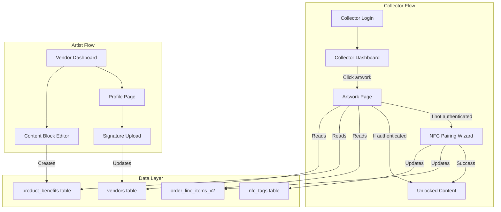
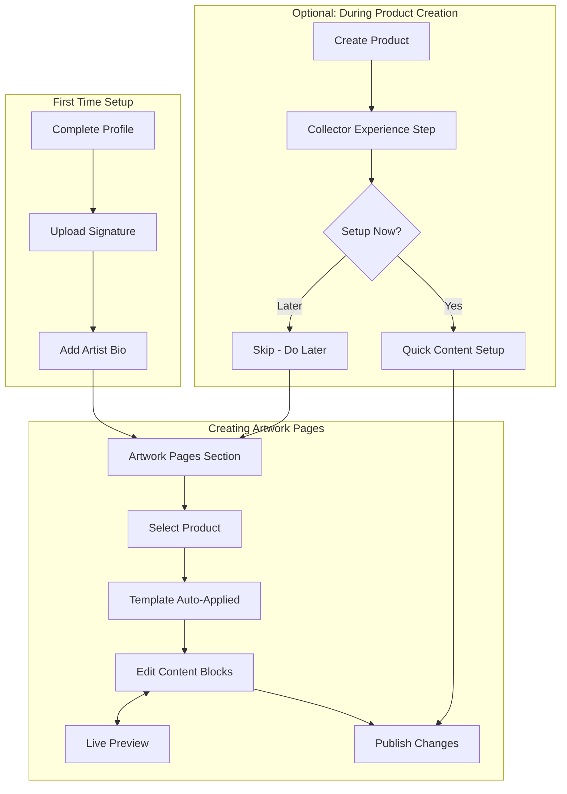

# Enhanced Collector Dashboard with NFC-Gated Artwork Pages

## Current State Summary

The collector dashboard (`/collector/dashboard`) displays purchased artworks via tabs (Overview, Collection, Editions, Artists, Certifications, Hidden Content). The admin CRM has a richer collector profile view at `/admin/collectors/[id]` with:

- Stacked artwork cards showing edition numbers (#X/Y format)
- Grouping by product or artist
- Stats grid (Active Collection, Market Value, etc.)
- Profile sidebar with avatar/InkOGatchi

The NFC pairing flow exists via `components/nfc/nfc-auth-sheet.tsx` and `/api/nfc-tags/claim`, which updates `order_line_items_v2.nfc_claimed_at` when a tag is successfully paired.

Artists currently add benefits via `product_benefits` table with types like Digital Content, Exclusive Access, etc.

---

## Part 1: Align Collector Dashboard with CRM Profile View

### 1.1 Enhance Dashboard Layout

Modify [`app/collector/dashboard/page.tsx`](app/collector/dashboard/page.tsx) to:

- Use the same "stacked deck" artwork card grouping from the admin page
- Show edition badges in `#{editionNumber}/{editionTotal}` format consistently
- Add grouping toggle (By Product / By Artist) like the admin view

Reference implementation from admin:

```430:445:app/admin/collectors/[id]/page.tsx
// Stacked card with edition badge
<Badge className="...">
  #{edition.editionNumber}{edition.editionTotal ? `/${edition.editionTotal}` : ''}
</Badge>
```

### 1.2 Admin-Collector Connection

Add a link in the admin collector profile to view as collector (impersonation for testing) and vice versa - in collector dashboard, show admin link if user is also an admin.

Files to modify:

- [`app/admin/collectors/[id]/page.tsx`](app/admin/collectors/[id]/page.tsx) - Add "View as Collector" button
- [`app/collector/dashboard/page.tsx`](app/collector/dashboard/page.tsx) - Add admin link if admin session exists

---

## Part 2: New Artwork Detail Page with NFC-Gated Content

### 2.1 Create Artwork Page Route

Create new page at `app/collector/artwork/[id]/page.tsx` with sections:

**Always Visible (Pre-Authentication):**

- Artwork image (blurred with lock icon if not NFC authenticated)
- Edition number and total (e.g., "#5 of 100")
- Artist name (linked to artist profile)
- Provenance summary (purchase date, order number)

**NFC Pairing Section:**

- If `nfc_claimed_at` is null: Show "Authenticate with NFC" button opening NFC wizard
- If `nfc_claimed_at` exists: Show "Authenticated" badge with timestamp

**Locked Content (Blurred + Lock Icon until NFC paired):**

- Artist signature image
- Artist bio section
- Content blocks (images, text, video, audio) added by artist

### 2.2 Create Artwork API Route

Create `app/api/collector/artwork/[id]/route.ts`:

```typescript
// Returns artwork details with authentication status and content blocks
interface ArtworkDetailResponse {
  artwork: {
    id: string
    name: string
    imgUrl: string
    editionNumber: number
    editionTotal: number
    purchaseDate: string
    orderNumber: string
    certificateUrl: string | null
    nfcTagId: string | null
    nfcClaimedAt: string | null  // null = not authenticated
  }
  artist: {
    name: string
    bio: string | null
    signatureUrl: string | null  // New field
    profileImageUrl: string | null
  }
  contentBlocks: ContentBlock[]  // Only returned if nfcClaimedAt exists
  series: { id: string; name: string } | null
}
```

### 2.3 NFC Authentication Flow on Artwork Page

Integrate `NFCAuthSheet` component into the artwork page:

```tsx
// When "Authenticate" clicked:
<NFCAuthSheet
  isOpen={isNfcSheetOpen}
  onClose={() => setIsNfcSheetOpen(false)}
  item={{
    line_item_id: artwork.lineItemId,
    order_id: artwork.orderId,
    name: artwork.name,
    edition_number: artwork.editionNumber
  }}
  onSuccess={() => {
    // Refresh page to unlock content
    refetchArtwork()
  }}
/>
```

### 2.4 NFC Writing URL for Collectors (Self-Programming)

**Use Case:** Collector wants to program their own NFC tag using third-party NFC writing software (like NFC Tools, TagWriter, etc.)

**Implementation:**

**Generate Unique Authentication URL:**

- Each line item gets a unique, permanent authentication URL
- Format: `https://app.thestreetcollector.com/auth/nfc/{token}`
- Token is a signed JWT containing: `lineItemId`, `orderId`, `editionNumber`

**API Endpoint:**

Create `app/api/collector/artwork/[id]/nfc-url/route.ts`:

- GET: Returns the NFC authentication URL for this artwork
- Response includes:
  - `nfcUrl`: The URL to write to the NFC tag
  - `instructions`: How to write it
  - `qrCode`: QR code image of the URL for easy copying

**Collector UI:**

Add "Program Your Own NFC Tag" section on artwork page:

```
┌─────────────────────────────────────────────────┐
│  Program Your Own NFC Tag                       │
│                                                 │
│  Use this URL with any NFC writing app:         │
│  ┌─────────────────────────────────────────────┐│
│  │ https://app.thestreetcollector.com/auth/... ││
│  └─────────────────────────────────────────────┘│
│  [Copy URL]  [Show QR Code]  [Download NFC File]│
│                                                 │
│  Instructions:                                  │
│  1. Download an NFC writing app (NFC Tools)     │
│  2. Create a new "URL" record                   │
│  3. Paste this URL                              │
│  4. Write to your NTAG215 or similar tag        │
│  5. Tap your new tag to authenticate            │
└─────────────────────────────────────────────────┘
```

**NFC URL Handler:**

Create `app/auth/nfc/[token]/route.ts`:

- Validates the signed token
- Extracts lineItemId, orderId
- If valid and not already claimed:
  - Claims the NFC tag (creates nfc_tags record)
  - Updates order_line_items_v2.nfc_claimed_at
  - Redirects to artwork page with "Authenticated!" success message
- If already claimed:
  - Shows "Already authenticated" with link to artwork page

### 2.5 NFC Fallback Options

**For Devices Without NFC:**

- Show "Manual Authentication" option
- Uses a unique code printed on physical certificate/packaging
- Collector enters code on artwork page → triggers authentication

**Implementation:**

- Add `auth_code` column to order_line_items_v2 (generated at order time)
- Add "Enter Authentication Code" input on artwork page
- API validates code and claims authentication

**UI Flow:**

```
Can't use NFC? 
[Enter Code Manually]

┌─────────────────────────────────────────┐
│ Enter the code from your certificate:   │
│ ┌─────────────────────────────────────┐ │
│ │ XXXX-XXXX-XXXX                      │ │
│ └─────────────────────────────────────┘ │
│ [Authenticate]                          │
└─────────────────────────────────────────┘
```

---

## Part 3: Artist Signature Upload

### 3.1 Add Signature Field to Vendors Table

Create migration:

```sql
ALTER TABLE vendors
ADD COLUMN IF NOT EXISTS signature_url TEXT,
ADD COLUMN IF NOT EXISTS signature_uploaded_at TIMESTAMP WITH TIME ZONE;
```

### 3.2 Update Vendor Profile Page

Modify [`app/vendor/dashboard/profile/page.tsx`](app/vendor/dashboard/profile/page.tsx) to add:

- Signature upload section (drag-and-drop or file picker)
- Preview of current signature
- Clear signature button

### 3.3 Create Signature Upload API

Create `app/api/vendor/profile/upload-signature/route.ts`:

- Accept image upload (PNG with transparency preferred)
- Store in Supabase storage bucket `vendor-signatures`
- Update `vendors.signature_url`

### 3.4 Prompt Artist on Series/Artwork Page Entry

When artist enters series page or artwork editing and signature is missing:

- Show modal prompting signature upload
- Link to profile page signature section
- Option to "Remind me later" (session-based dismissal)

---

## Part 4: Artist Content Blocks for Artwork Pages (Clear UX for Artists)

### 4.1 Design Principles for Artist Clarity

**Goal:** Make it dead simple for artists to understand what they need to do and why.

**Key UX Decisions:**

- Pre-filled template with placeholder content they customize
- Modular but simple block types (Text, Image, Video, Audio)
- Optional step during product creation, plus standalone "Artwork Pages" section
- Clear visual preview of what collectors will see

### 4.2 Extend Benefit Types

Add new benefit types for artwork page content blocks:

```sql
INSERT INTO benefit_types (name, description, icon) VALUES
  ('Artwork Text Block', 'Text content for the artwork page', 'type'),
  ('Artwork Image Block', 'Image content for the artwork page', 'image'),
  ('Artwork Video Block', 'Video link for the artwork page', 'video'),
  ('Artwork Audio Block', 'Audio message for the artwork page', 'music')
ON CONFLICT (name) DO NOTHING;
```

### 4.3 Add Content Block Position Field

Add migration for ordering:

```sql
ALTER TABLE product_benefits
ADD COLUMN IF NOT EXISTS display_order INTEGER DEFAULT 0,
ADD COLUMN IF NOT EXISTS block_config JSONB;  -- For video URLs, audio URLs, etc.
```

### 4.4 Create Standalone "Artwork Pages" Section in Vendor Dashboard

Add new navigation item in vendor sidebar: **"Artwork Pages"**

Create `app/vendor/dashboard/artwork-pages/page.tsx`:

- List of all products with artwork page status (Complete / Incomplete / Not Started)
- Visual cards showing thumbnail, title, and completion indicator
- Click to edit artwork page content
- Bulk actions: "Apply template to all" option

### 4.5 Pre-Filled Template System

When artist opens content editor for the first time, auto-generate a template:

**Default Template Structure:**

| Order | Block Type | Pre-filled Content | Artist Action |

|-------|------------|-------------------|---------------|

| 1 | Artist Signature | Auto-pulled from profile | Cannot edit here (link to profile) |

| 2 | Artist Bio | Auto-pulled from profile bio | Cannot edit here (link to profile) |

| 3 | Text Block | "Tell the story behind this piece..." | Edit placeholder text |

| 4 | Image Block | Empty with "Add a behind-the-scenes photo" prompt | Upload image |

| 5 | Video Block | Empty with "Add a video message (optional)" | Paste YouTube/Vimeo URL |

| 6 | Audio Block | Empty with "Record or upload an audio message (optional)" | Upload audio |

**Visual Indicators:**

- Green checkmark on completed blocks
- Yellow "needs attention" on empty required blocks
- Gray "optional" label on optional blocks

### 4.6 Create Content Block Editor UI

Create `app/vendor/dashboard/artwork-pages/[productId]/page.tsx`:

**Layout (Two-Panel):**

**Left Panel: Editor**

- Vertical list of content blocks with drag handles
- Each block shows: Type icon, Title, Preview/Edit toggle
- "Add Block" button at bottom with simple dropdown: Text / Image / Video / Audio
- Reorder via drag-and-drop (react-beautiful-dnd or similar)

**Right Panel: Live Preview**

- Shows exactly what collector will see after NFC unlock
- Updates in real-time as artist edits
- "Locked" vs "Unlocked" toggle to preview both states
- Mobile/Desktop viewport toggle

**Header:**

- Artwork title and thumbnail
- "Publish Changes" button (saves all blocks)
- "Preview as Collector" button (opens preview modal)
- Completion progress: "3 of 4 blocks complete"

### 4.7 Block Type Details

**Text Block:**

- Simple rich text editor (bold, italic, links only - no complex formatting)
- Character limit: 2000
- Placeholder: "Share the inspiration, process, or meaning behind this piece..."

**Image Block:**

- Drag-and-drop upload area
- Caption field (optional, 200 chars)
- Suggested: "Behind-the-scenes photo", "Process shot", "Detail close-up"

**Video Block:**

- URL input field
- Paste YouTube or Vimeo link
- Auto-embed preview
- Suggested: "Artist message", "Studio tour", "Process video"

**Audio Block:**

- Upload audio file OR paste SoundCloud/external link
- Duration display
- Suggested: "Personal message to collector", "Story narration"

### 4.8 Optional Integration with Product Creation Wizard

Add optional step to existing product wizard at [`app/vendor/dashboard/products/create/components/product-wizard.tsx`](app/vendor/dashboard/products/create/components/product-wizard.tsx):

**New Step: "Collector Experience" (Optional)**

- Shows after Review step, before Submit
- "Would you like to set up the artwork page collectors will see after authentication?"
- Two options:
  - "Set up now" -> Opens simplified inline version of content editor
  - "I'll do this later" -> Skips, creates product without content blocks

### 4.9 Profile Completeness Prompts

When artist enters Artwork Pages section with incomplete profile:

**Missing Signature:**

```
"Your signature will appear on every artwork page. 
Upload your signature to continue."
[Upload Signature] [Go to Profile]
```

**Missing Bio:**

```
"Your artist bio appears on artwork pages.
Add a bio to help collectors connect with you."
[Go to Profile]
```

### 4.10 Create Content Blocks API

Create `app/api/vendor/artwork-pages/[productId]/route.ts`:

- GET: Fetch content blocks for product (with template defaults if none exist)
- POST: Add new content block
- PUT: Update content block order or content
- DELETE: Remove content block

Create `app/api/vendor/artwork-pages/[productId]/apply-template/route.ts`:

- POST: Apply default template to product (creates all default blocks)

---

## Part 4B: Enhanced Artist Features

### 4.11 Series-Level Content Templates

Allow artists to create a template at the series level that applies to all artworks:

**UI in Series Detail Page:**

- "Set Series Template" button
- Opens same content block editor but for the series
- All artworks in series inherit this template unless overridden

**Database:**

- Add `series_id` column to product_benefits (nullable)
- When fetching content for an artwork:

  1. First check for artwork-specific content blocks
  2. If none, fall back to series-level template
  3. If none, use default empty template

**Artist Workflow:**

- Create series → Set up series template once
- All artworks in series automatically get that content
- Individual artworks can "Override template" to customize

### 4.12 Copy Content from Another Artwork

**UI in Content Editor Header:**

- "Copy from..." dropdown
- Shows list of other artworks with existing content
- Selecting one imports all content blocks (duplicated, not linked)
- Artist can then customize

**API:**

- POST `/api/vendor/artwork-pages/[productId]/copy-from`
- Body: `{ sourceProductId: string }`
- Duplicates all content blocks from source to target

### 4.13 Auto-Save Drafts

**Implementation:**

- Content blocks saved as drafts automatically every 30 seconds
- Add `is_published` boolean to product_benefits
- "Save Draft" happens automatically; "Publish" sets `is_published = true`
- Collectors only see published content

**UI Indicators:**

- "Draft saved" with timestamp in editor header
- "Unpublished changes" warning if navigating away
- "Publish Changes" button to make live

### 4.14 Content Analytics for Artists

**Track on collector artwork page:**

- Page view (after NFC authentication)
- Video play events
- Audio play events
- Time spent on page

**Database:**

- Create `artwork_page_analytics` table:
  - `id`, `product_id`, `line_item_id`, `event_type`, `created_at`
  - Event types: `page_view`, `video_play`, `audio_play`

**UI in Artwork Pages Section:**

- Show per-artwork stats: "Viewed 12 times | Video played 8 times"
- Simple bar chart showing views over time (optional, can add later)

### 4.15 Collector Authentication Notifications

**Notification Types:**

- Real-time toast in vendor dashboard: "A collector just authenticated [Artwork Name]"
- Weekly digest email (optional, artist can configure)

**Implementation:**

- After successful NFC claim, trigger notification to vendor
- Store notification preferences in vendors table
- Use existing email service for digest

**Vendor Settings Page Addition:**

- "Notify me when collectors authenticate" toggle
- "Weekly authentication digest" toggle

---

## Part 5: Collector Artwork Page Content Rendering

### 5.1 Content Block Components

Create `app/collector/artwork/[id]/components/`:

- `TextBlock.tsx` - Renders markdown/HTML text
- `ImageBlock.tsx` - Renders image with caption
- `VideoBlock.tsx` - Embeds YouTube/Vimeo
- `AudioBlock.tsx` - Audio player
- `ArtistBioBlock.tsx` - Artist bio with profile image
- `ArtistSignatureBlock.tsx` - Displays signature image
- `LockedOverlay.tsx` - Blur + lock icon overlay

### 5.2 Conditional Rendering Logic

```tsx
// In artwork page
const isAuthenticated = !!artwork.nfcClaimedAt

return (
  <div>
    {/* Always visible */}
    <ArtworkHeader artwork={artwork} />
    <EditionBadge number={artwork.editionNumber} total={artwork.editionTotal} />
    
    {/* NFC Section */}
    {!isAuthenticated ? (
      <NFCPairingPrompt onPair={() => setIsNfcSheetOpen(true)} />
    ) : (
      <AuthenticatedBadge claimedAt={artwork.nfcClaimedAt} />
    )}
    
    {/* Content - Locked or Unlocked */}
    <div className={!isAuthenticated ? "blur-sm pointer-events-none relative" : ""}>
      {!isAuthenticated && <LockedOverlay />}
      <ArtistSignatureBlock signatureUrl={artist.signatureUrl} />
      <ArtistBioBlock artist={artist} />
      {contentBlocks.map(block => (
        <ContentBlock key={block.id} block={block} />
      ))}
    </div>
  </div>
)
```

---

## Part 6: Navigation Integration

### 6.1 Dashboard to Artwork Page

In collector dashboard artwork cards, clicking an artwork navigates to `/collector/artwork/[lineItemId]`

Modify:

- `app/collector/dashboard/components/editions-gallery.tsx`
- `app/collector/dashboard/components/artwork-grid.tsx`
- `app/collector/dashboard/components/purchases-section.tsx`

### 6.2 Artist to Content Block Editor

In vendor dashboard, add "Edit Artwork Page" button on product detail:

- Links to `/vendor/dashboard/products/[id]/content-blocks`

---

## Architecture Diagram



---

## Files to Create

| File | Purpose |

|------|---------|

| `app/collector/artwork/[id]/page.tsx` | Artwork detail page with NFC gating |

| `app/api/collector/artwork/[id]/route.ts` | Artwork detail API |

| `app/api/collector/artwork/[id]/nfc-url/route.ts` | Generate NFC writing URL for self-programming |

| `app/auth/nfc/[token]/route.ts` | Handle NFC URL authentication |

| `app/collector/artwork/[id]/components/*.tsx` | Content block components (Text, Image, Video, Audio, Bio, Signature, LockedOverlay, NFCUrlSection, ManualCodeAuth) |

| `app/vendor/dashboard/artwork-pages/page.tsx` | Standalone artwork pages list with analytics |

| `app/vendor/dashboard/artwork-pages/[productId]/page.tsx` | Content block editor with live preview and auto-save |

| `app/vendor/dashboard/artwork-pages/components/BlockEditor.tsx` | Individual block editing component |

| `app/vendor/dashboard/artwork-pages/components/LivePreview.tsx` | Real-time preview panel |

| `app/vendor/dashboard/artwork-pages/components/BlockTypeSelector.tsx` | Add block dropdown |

| `app/vendor/dashboard/artwork-pages/components/CopyContentModal.tsx` | Copy from another artwork modal |

| `app/api/vendor/artwork-pages/[productId]/route.ts` | Content blocks CRUD API with auto-save |

| `app/api/vendor/artwork-pages/[productId]/apply-template/route.ts` | Apply default template API |

| `app/api/vendor/artwork-pages/[productId]/copy-from/route.ts` | Copy content from another artwork |

| `app/api/vendor/artwork-pages/series/[seriesId]/route.ts` | Series-level template CRUD |

| `app/api/vendor/profile/upload-signature/route.ts` | Signature upload API |

| `app/api/collector/artwork/[id]/analytics/route.ts` | Track page views, video/audio plays |

| `supabase/migrations/XXXX_add_vendor_signature.sql` | Add signature_url to vendors |

| `supabase/migrations/XXXX_add_content_block_fields.sql` | Add display_order, block_config, series_id, is_published to product_benefits + new benefit types |

| `supabase/migrations/XXXX_add_analytics_and_auth_code.sql` | Create artwork_page_analytics table, add auth_code to order_line_items_v2 |

## Files to Modify

| File | Changes |

|------|---------|

| `app/collector/dashboard/page.tsx` | Add grouping toggle, enhance edition display |

| `app/collector/dashboard/components/editions-gallery.tsx` | Link to artwork page |

| `app/vendor/dashboard/profile/page.tsx` | Add signature upload section |

| `app/vendor/dashboard/settings/page.tsx` | Add notification preferences for authentication alerts |

| `app/vendor/components/vendor-sidebar.tsx` | Add "Artwork Pages" nav item |

| `app/vendor/dashboard/series/[id]/page.tsx` | Add "Set Series Template" button |

| `app/vendor/dashboard/products/create/components/product-wizard.tsx` | Add optional "Collector Experience" step |

| `app/api/nfc-tags/claim/route.ts` | Trigger vendor notification on successful claim |

| `app/admin/collectors/[id]/page.tsx` | Add "View as Collector" link |

---

## Artist UX Flow Summary



---

## Key Artist Clarity Features

1. **Pre-filled Template**: Artists never face a blank page - they see placeholder content to customize
2. **Live Preview**: See exactly what collectors will experience in real-time
3. **Completion Progress**: Clear indicators of what's done and what's needed
4. **Profile Integration**: Signature and bio auto-populate - one place to update
5. **Simple Block Types**: Only 4 types (Text, Image, Video, Audio) - no overwhelm
6. **Optional Timing**: Can set up during product creation OR visit dedicated section later
7. **Status Dashboard**: See all products and their artwork page completion status at a glance