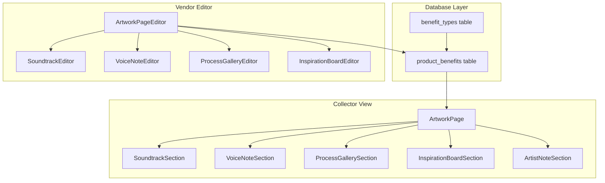
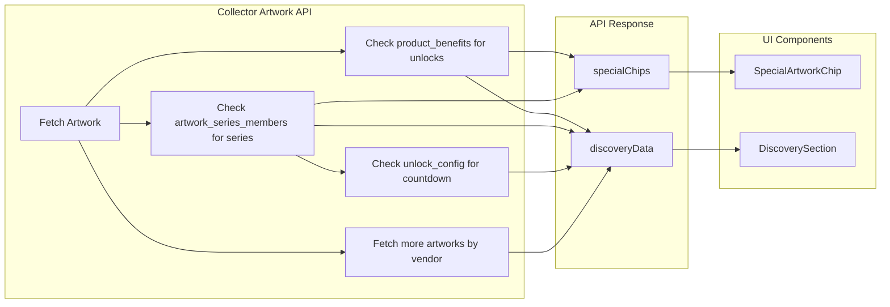

# Immersive Artwork Experience

Transform the collector artwork page from a basic content display into an immersive "creative journal" experience where artists can share their process, inspirations, voice notes, and soundtrack.

## Architecture Overview




## Phase 1: Database Schema Updates

### 1.1 Add New Benefit Types

Create migration: `supabase/migrations/[timestamp]_add_immersive_block_types.sql`

New benefit types to add:

- `Artwork Soundtrack Block` - Spotify track with optional note
- `Artwork Voice Note Block` - Artist audio messages with title/transcript
- `Artwork Process Gallery Block` - Ordered images with captions showing creation process
- `Artwork Inspiration Block` - Mood board images with story text

### 1.2 block_config JSONB Structures

Define the JSON structure for each new block type:

```typescript
// Soundtrack
{ spotify_url: string, note?: string }

// Voice Note
{ title: string, transcript?: string }

// Process Gallery
{ intro?: string, images: Array<{ url: string, caption?: string, order: number }> }

// Inspiration Board
{ story?: string, images: Array<{ url: string, caption?: string }> }
```

---

## Phase 2: New Collector-Facing Components

Create components in `app/collector/artwork/[id]/components/`:

### 2.1 SoundtrackSection.tsx

- Spotify embed using oEmbed API (no auth required)
- Optional artist note about why they chose this track
- Compact player with album art
- "Open in Spotify" link
- Props: `spotifyUrl: string`, `note?: string`

### 2.2 VoiceNoteSection.tsx

- Custom audio player with waveform visualization
- Support for multiple voice notes (swipeable)
- Artist profile photo display
- Play/pause, progress bar, time display
- Optional transcript toggle
- Props: `title: string`, `contentUrl: string`, `transcript?: string`, `artistPhoto?: string`

### 2.3 ProcessGallerySection.tsx

- Horizontal scrolling thumbnail strip
- Large preview area for selected image
- Caption display per image
- Supports images and short video clips
- Intro text explaining the process
- Props: `intro?: string`, `images: Array<{url, caption, order}>`

### 2.4 InspirationBoardSection.tsx

- Masonry/Pinterest-style grid layout
- Tap to expand any image with caption
- Story text introduction
- Props: `story?: string`, `images: Array<{url, caption}>`

### 2.5 ArtistNoteSection.tsx

- Letter-style typography (large, elegant)
- Artist signature at bottom
- Clean, editorial presentation
- Props: `content: string`, `signatureUrl?: string`

### 2.6 DiscoverySection.tsx

End-of-page section showing what comes next for the collector. Displays contextually based on artwork relationships:

**Display Modes (priority order):**

1. **Unlock Reward** - If owning this artwork unlocks a hidden series or VIP artwork
2. **Series Countdown** - If artwork is part of a time-based series with upcoming unlocks
3. **Next in Series** - If artwork is part of a sequential series
4. **More from Artist** - Next drops or other available artworks by the same artist

**Layout:**

```
DISCOVER MORE
─────────────

┌─────────────────────────────────────────────┐
│  UNLOCKED BY THIS PIECE                     │
│                                             │
│  ┌─────────┐                                │
│  │ [blur]  │  Hidden Series Name            │
│  │         │  "You've unlocked access to    │
│  └─────────┘   this exclusive series"       │
│                                             │
│              [Explore Series]               │
└─────────────────────────────────────────────┘

OR

┌─────────────────────────────────────────────┐
│  NEXT IN SERIES                             │
│  "Echoes" - 3 of 5                          │
│                                             │
│  ┌────┐ ┌────┐ ┌────┐ ┌────┐ ┌────┐        │
│  │ ✓  │ │ ✓  │ │ ✓  │ │ 🔒 │ │ 🔒 │        │
│  └────┘ └────┘ └────┘ └────┘ └────┘        │
│                                             │
│  Next unlock: "Artwork Name"                │
│              [View Series]                  │
└─────────────────────────────────────────────┘

OR

┌─────────────────────────────────────────────┐
│  COMING SOON                                │
│                                             │
│  ┌─────────┐   Next artwork unlocks in      │
│  │ [blur]  │                                │
│  │  ⏱️    │   2d 14h 32m                   │
│  └─────────┘                                │
│              [Set Reminder]                 │
└─────────────────────────────────────────────┘

OR

┌─────────────────────────────────────────────┐
│  MORE FROM [ARTIST NAME]                    │
│                                             │
│  ┌────────┐ ┌────────┐ ┌────────┐          │
│  │        │ │        │ │        │    →     │
│  │        │ │        │ │        │          │
│  └────────┘ └────────┘ └────────┘          │
│                                             │
│              [View All]                     │
└─────────────────────────────────────────────┘
```

**Props:**

```typescript
interface DiscoverySectionProps {
  artworkId: string
  artistName: string
  seriesId?: string
  unlockedContent?: {
    type: 'hidden_series' | 'vip_artwork' | 'vip_series'
    id: string
    name: string
    thumbnailUrl?: string
  }
  seriesInfo?: {
    name: string
    totalCount: number
    ownedCount: number
    artworks: Array<{ id: string, name: string, imgUrl: string, isOwned: boolean, isLocked: boolean }>
    nextArtwork?: { id: string, name: string, imgUrl: string }
    unlockType: 'sequential' | 'time_based' | 'threshold' | 'any_purchase'
  }
  countdown?: {
    unlockAt: string // ISO timestamp
    artworkName: string
    artworkImgUrl?: string
  }
  moreFromArtist?: Array<{
    id: string
    name: string
    imgUrl: string
    price?: string
  }>
}
```

### 2.7 SpecialArtworkChip.tsx

Chips/badges displayed on the artwork page (both locked and unlocked states) indicating special properties:

**Chip Types:**

- **Unlocks Hidden Content** - This artwork unlocks a hidden series or VIP artwork
- **Part of Series** - Shows series name and position (e.g., "Echoes 3/5")
- **Timed Release** - Part of a time-based unlock series
- **VIP Access** - Grants VIP tier access
- **Limited Edition** - Shows edition info prominently
- **Authenticated** - Shows NFC verified status

**Visual Design:**

```
┌─────────────────────────────────────────────┐
│  [Artwork Image]                            │
│                                             │
│  ┌──────────────────┐ ┌─────────────────┐   │
│  │ 🔓 Unlocks       │ │ 📀 Echoes 3/5   │   │
│  │    Hidden Series │ └─────────────────┘   │
│  └──────────────────┘                       │
│                                             │
│  ┌──────────────────┐                       │
│  │ ⏱️ Timed Release │                       │
│  └──────────────────┘                       │
└─────────────────────────────────────────────┘
```

**Props:**

```typescript
interface SpecialArtworkChipProps {
  type: 'unlocks_hidden' | 'series' | 'timed_release' | 'vip_access' | 'limited_edition' | 'authenticated'
  label: string
  sublabel?: string
  icon?: string
}
```

**Placement:**

- On HeroSection below the artwork image
- Visible in both locked and unlocked states
- Horizontal scrolling if many chips

---

## Phase 3: Visual Redesign of Artwork Page

Update [app/collector/artwork/[id]/page.tsx](app/collector/artwork/[id]/page.tsx):

### 3.1 Layout Changes

- Remove card borders - content floats freely
- Full-bleed hero image with sticky scroll behavior
- Generous whitespace between sections (py-16 or larger)
- Dark mode as default for artwork pages
- Smooth scroll-triggered fade-in animations

### 3.2 Token/Edition Display

Update [app/collector/artwork/[id]/components/HeroSection.tsx](app/collector/artwork/[id]/components/HeroSection.tsx):

- Cleaner edition badge (minimal, typographic)
- Add subtle timeline: Created > Acquired > Authenticated
- Remove heavy gradients, use subtle overlays

### 3.3 Unlock Animation

Update [app/collector/artwork/[id]/components/UnlockReveal.tsx](app/collector/artwork/[id]/components/UnlockReveal.tsx):

- Replace confetti with smooth blur-dissolve animation
- Content fades from `blur(20px)` to `blur(0)`
- Haptic feedback on mobile
- Faster, more elegant transition (0.8s)

### 3.4 Locked State Preview

Update [app/collector/artwork/[id]/components/LockedContentPreview.tsx](app/collector/artwork/[id]/components/LockedContentPreview.tsx):

- Show blurred thumbnails of actual content
- Display count: "5 exclusive pieces await"
- Icons representing content types
- Less "paywall" feel, more "teaser" feel

---

## Phase 4: Artist Content Builder Redesign

The current editor is functional but utilitarian. Artists should feel like they're crafting something special, not filling out a form. The builder needs to feel as premium as the collector experience.

### 4.1 New Builder Layout & Feel

Replace the current two-column Card-based layout with a more immersive builder:

**Current State (problems):**

- Generic card containers
- Form-like appearance with basic inputs
- Small, cramped preview
- No visual feedback for quality content
- Feels like data entry, not creation

**New Design Principles:**

- Full-width, breathing layout
- Visual-first editing (see what you're building)
- Inline editing where possible
- Progress/completeness indicators
- Encouraging copy and guidance
- Dark mode option to match collector view

**New Layout Structure:**

```
┌─────────────────────────────────────────────────────────────┐
│  [← Back]     "Echoes #3"              [Preview] [Publish]  │
│               by Artist Name                                │
├─────────────────────────────────────────────────────────────┤
│                                                             │
│  ┌─────────────────────────────────────────────────────┐   │
│  │                                                     │   │
│  │     [Artwork Image - Large Hero Preview]            │   │
│  │                                                     │   │
│  │     Edition 12/50                                   │   │
│  │                                                     │   │
│  └─────────────────────────────────────────────────────┘   │
│                                                             │
│  ━━━━━━━━━━━━━━━━━━━━━━━━━━━━━━━━━━━━━━━━━━━━━━━━━━━━━━━   │
│  Your Story                                    75% Complete │
│  ━━━━━━━━━━━━━━━━━━━━━━━━━━━━━━━━━━━━━━━━━━━━━━━━━━━━━━━   │
│                                                             │
│  ┌─────────────────────────────────────────────────────┐   │
│  │  🎵  SOUNDTRACK                              [Edit] │   │
│  │                                                     │   │
│  │      "Set the mood. What were you listening to?"   │   │
│  │                                                     │   │
│  │      ┌──────────────────────────────────────────┐  │   │
│  │      │  [Spotify Player Preview]                │  │   │
│  │      │  Song Title - Artist                     │  │   │
│  │      └──────────────────────────────────────────┘  │   │
│  │                                                     │   │
│  │      "This track captures the energy I was         │   │
│  │       going for..."                                │  │
│  │                                                     │   │
│  └─────────────────────────────────────────────────────┘   │
│                                                             │
│  ┌─────────────────────────────────────────────────────┐   │
│  │  🎤  VOICE NOTE                              [Edit] │   │
│  │                                                     │   │
│  │      "Leave a personal message for collectors"     │   │
│  │                                                     │   │
│  │      ┌──────────────────────────────────────────┐  │   │
│  │      │  ●━━━━━━━━━━━━━━━━━━━━━━━━━━━━━━━●  2:34 │  │   │
│  │      │            ▶  [Record New]               │  │   │
│  │      └──────────────────────────────────────────┘  │   │
│  │                                                     │   │
│  └─────────────────────────────────────────────────────┘   │
│                                                             │
│  ┌─────────────────────────────────────────────────────┐   │
│  │  📸  PROCESS GALLERY                         [Edit] │   │
│  │                                                     │   │
│  │      "Show how this piece came to life"            │   │
│  │                                                     │   │
│  │      ┌────┐ ┌────┐ ┌────┐ ┌────┐ ┌────┐ ┌────┐    │   │
│  │      │ 1  │ │ 2  │ │ 3  │ │ 4  │ │ 5  │ │ +  │    │   │
│  │      └────┘ └────┘ └────┘ └────┘ └────┘ └────┘    │   │
│  │                                                     │   │
│  └─────────────────────────────────────────────────────┘   │
│                                                             │
│  ┌ ─ ─ ─ ─ ─ ─ ─ ─ ─ ─ ─ ─ ─ ─ ─ ─ ─ ─ ─ ─ ─ ─ ─ ─ ─ ┐   │
│  │  💡  INSPIRATION BOARD                       [Add] │   │
│  │                                                     │   │
│  │      "What inspired this work? Share references,   │   │
│  │       mood images, or visual influences"           │   │
│  │                                                     │   │
│  │                   [+ Add Images]                   │   │
│  │                                                     │   │
│  └ ─ ─ ─ ─ ─ ─ ─ ─ ─ ─ ─ ─ ─ ─ ─ ─ ─ ─ ─ ─ ─ ─ ─ ─ ─ ┘   │
│                                                             │
│                        [+ Add Section]                      │
│                                                             │
└─────────────────────────────────────────────────────────────┘
```

### 4.2 Section Cards with Context

Each section type has:

- Icon and clear label
- Helpful prompt/guidance text
- Visual preview of content (not just form fields)
- Completion indicator (empty, partial, complete)
- Expand/collapse for editing

**Section States:**

```
EMPTY (dashed border, muted):
┌ ─ ─ ─ ─ ─ ─ ─ ─ ─ ─ ─ ─ ─ ─ ┐
│  🎵 Soundtrack         [Add] │
│  "Set the mood..."           │
└ ─ ─ ─ ─ ─ ─ ─ ─ ─ ─ ─ ─ ─ ─ ┘

PARTIAL (solid border, subtle warning):
┌─────────────────────────────┐
│  🎵 Soundtrack        [Edit]│
│  ⚠️ Missing: artist note    │
│  [Spotify Preview]          │
└─────────────────────────────┘

COMPLETE (solid border, success accent):
┌─────────────────────────────┐
│  🎵 Soundtrack    ✓  [Edit] │
│  [Spotify Preview]          │
│  "This track captures..."   │
└─────────────────────────────┘
```

### 4.3 Inline Editing Experience

When artist clicks [Edit] on a section, it expands inline (not a modal):

```
┌─────────────────────────────────────────────────────────────┐
│  🎵  SOUNDTRACK                              [Done] [×]     │
│  ━━━━━━━━━━━━━━━━━━━━━━━━━━━━━━━━━━━━━━━━━━━━━━━━━━━━━━━   │
│                                                             │
│  Spotify Track URL                                          │
│  ┌─────────────────────────────────────────────────────┐   │
│  │  https://open.spotify.com/track/...                 │   │
│  └─────────────────────────────────────────────────────┘   │
│  ✓ Valid Spotify URL                                        │
│                                                             │
│  ┌──────────────────────────────────────────────────────┐  │
│  │  [Live Spotify Embed Preview]                        │  │
│  │  Song Title - Artist Name                            │  │
│  └──────────────────────────────────────────────────────┘  │
│                                                             │
│  Why this track? (optional but recommended)                 │
│  ┌─────────────────────────────────────────────────────┐   │
│  │  This song was on repeat while I worked on the      │   │
│  │  final details. The rhythm mirrors the visual       │   │
│  │  flow I was going for...                            │   │
│  │                                                     │   │
│  └─────────────────────────────────────────────────────┘   │
│  142/500 characters                                         │
│                                                             │
│  💡 Tip: Collectors love knowing the creative context       │
│                                                             │
└─────────────────────────────────────────────────────────────┘
```

### 4.4 Voice Note Recording UI

Premium recording experience with visual feedback:

```
┌─────────────────────────────────────────────────────────────┐
│  🎤  VOICE NOTE                              [Done] [×]     │
│  ━━━━━━━━━━━━━━━━━━━━━━━━━━━━━━━━━━━━━━━━━━━━━━━━━━━━━━━   │
│                                                             │
│  Title                                                      │
│  ┌─────────────────────────────────────────────────────┐   │
│  │  About this piece                                   │   │
│  └─────────────────────────────────────────────────────┘   │
│                                                             │
│  ┌──────────────────────────────────────────────────────┐  │
│  │                                                      │  │
│  │          ╭────────────────────────╮                  │  │
│  │          │                        │                  │  │
│  │          │   ▄▃▅▇█▇▅▃▂▁▂▃▅▇█▇▅   │  ← Live waveform │  │
│  │          │                        │                  │  │
│  │          ╰────────────────────────╯                  │  │
│  │                                                      │  │
│  │                    ● 0:47                            │  │
│  │                                                      │  │
│  │              [ ⏹ Stop Recording ]                    │  │
│  │                                                      │  │
│  └──────────────────────────────────────────────────────┘  │
│                                                             │
│  OR                                                         │
│                                                             │
│  ┌─────────────────────────────────────────────────────┐   │
│  │  📁 Upload Audio File                               │   │
│  │  MP3, WAV, M4A up to 20MB                          │   │
│  └─────────────────────────────────────────────────────┘   │
│                                                             │
│  💡 Tip: Keep it personal - 1-3 minutes is ideal           │
│                                                             │
└─────────────────────────────────────────────────────────────┘
```

### 4.5 Process Gallery Editor

Drag-and-drop with visual reordering:

```
┌─────────────────────────────────────────────────────────────┐
│  📸  PROCESS GALLERY                         [Done] [×]     │
│  ━━━━━━━━━━━━━━━━━━━━━━━━━━━━━━━━━━━━━━━━━━━━━━━━━━━━━━━   │
│                                                             │
│  Introduction (optional)                                    │
│  ┌─────────────────────────────────────────────────────┐   │
│  │  This piece started as a quick sketch and evolved   │   │
│  │  over several weeks...                              │   │
│  └─────────────────────────────────────────────────────┘   │
│                                                             │
│  Images (drag to reorder)                                   │
│                                                             │
│  ┌────────────────┐ ┌────────────────┐ ┌────────────────┐  │
│  │                │ │                │ │                │  │
│  │   [Image 1]    │ │   [Image 2]    │ │   [Image 3]    │  │
│  │                │ │                │ │                │  │
│  │ ≡              │ │ ≡              │ │ ≡              │  │
│  ├────────────────┤ ├────────────────┤ ├────────────────┤  │
│  │ Initial sketch │ │ Color study    │ │ Final details  │  │
│  │ [Edit] [×]     │ │ [Edit] [×]     │ │ [Edit] [×]     │  │
│  └────────────────┘ └────────────────┘ └────────────────┘  │
│                                                             │
│  ┌ ─ ─ ─ ─ ─ ─ ─ ─ ─ ─ ─ ─ ─ ─ ─ ─ ┐                      │
│  │                                  │                      │
│  │         + Add Images             │                      │
│  │     Drop files or click          │                      │
│  │                                  │                      │
│  └ ─ ─ ─ ─ ─ ─ ─ ─ ─ ─ ─ ─ ─ ─ ─ ─ ┘                      │
│                                                             │
│  💡 Tip: Show the journey - early sketches, works in       │
│     progress, and close-up details work great              │
│                                                             │
└─────────────────────────────────────────────────────────────┘
```

### 4.6 Progress & Completeness

Show artists their progress building a compelling page:

```
━━━━━━━━━━━━━━━━━━━━━━━━━━━━━━━━━━━━━━━━━━━━━━━━━━
Your Collector Experience                75% Complete
━━━━━━━━━━━━━━━━━━━━━━━━━━━━━━━━━━━━━━━━━━━━━━━━━━

✓ Soundtrack added
✓ Voice note recorded  
✓ Process gallery (6 images)
○ Inspiration board (recommended)
✓ Artist's note

"Great progress! Adding an inspiration board helps
 collectors understand your creative vision."
```

**Completeness Logic:**

- Required: At least 1 content section
- Recommended: 3+ sections for "Complete" badge
- Bonus: Personal touches (voice note, inspiration board)

### 4.7 Mobile Preview Toggle

Let artists see exactly what collectors will see:

```
┌─────────────────────────────────────────────────┐
│  Preview Mode                                   │
│                                                 │
│  [Desktop] [Mobile] [Locked] [Unlocked]        │
│                ↓                                │
│  ┌─────────────────────┐                       │
│  │ ┌─────────────────┐ │                       │
│  │ │                 │ │                       │
│  │ │  Mobile Frame   │ │                       │
│  │ │    Preview      │ │                       │
│  │ │                 │ │                       │
│  │ │                 │ │                       │
│  │ └─────────────────┘ │                       │
│  └─────────────────────┘                       │
│                                                 │
│         [Open Full Preview →]                  │
└─────────────────────────────────────────────────┘
```

### 4.8 Encouraging Empty States

When sections are empty, show inspiring prompts:

**Soundtrack:**

> "What song captures the energy of this piece? Music creates an emotional connection with your collectors."

**Voice Note:**

> "Your voice is powerful. A personal message makes collectors feel like they're getting a private studio visit."

**Process Gallery:**

> "Pull back the curtain. Show early sketches, works in progress, or the tools you used."

**Inspiration Board:**

> "What influenced this work? Photos, screenshots, textures - help collectors see through your eyes."

**Artist's Note:**

> "Write from the heart. What does this piece mean to you? What should collectors know?"

### 4.9 New Components for Builder

Create in `app/vendor/dashboard/artwork-pages/components/`:

**BuilderSection.tsx** - Wrapper for each section with state handling
**BuilderProgress.tsx** - Progress bar and completeness indicator
**SoundtrackEditor.tsx** - Spotify URL + note with live preview
**VoiceNoteRecorder.tsx** - Recording UI with waveform
**ProcessGalleryEditor.tsx** - Drag-and-drop image manager
**InspirationBoardEditor.tsx** - Masonry image uploader
**ArtistNoteEditor.tsx** - Rich text editor for notes
**MobilePreviewFrame.tsx** - Phone frame for preview
**SectionEmptyState.tsx** - Encouraging prompts for empty sections

### 4.10 Update Template

Update [app/api/vendor/artwork-pages/[productId]/apply-template/route.ts](app/api/vendor/artwork-pages/[productId]/apply-template/route.ts):

- Add new block types to default template
- Order: Soundtrack, Voice Note, Process Gallery, Inspiration Board, Artist's Note
- Include helpful placeholder text for each section

---

## Phase 5: API Updates

### 5.1 Update Artwork Pages API

Update [app/api/vendor/artwork-pages/[productId]/route.ts](app/api/vendor/artwork-pages/[productId]/route.ts):

- Handle new block types in POST/PUT
- Validate block_config structure for each type
- Support multi-image uploads for gallery blocks

### 5.2 Update Collector Artwork API

Update [app/api/collector/artwork/[id]/route.ts](app/api/collector/artwork/[id]/route.ts):

- Return new block types with proper mapping
- Include block_config in response
- Add discovery data to response:
  - Query `product_benefits` for `hidden_series_id`, `vip_artwork_id`, `vip_series_id`
  - Query `artwork_series_members` for series position and related artworks
  - Query series `unlock_config` for countdown info
  - Query other artworks by same vendor

**New response fields:**

```typescript
{
  // ...existing fields...
  discoveryData: {
    unlockedContent?: { type, id, name, thumbnailUrl }
    seriesInfo?: { name, totalCount, ownedCount, artworks, nextArtwork, unlockType }
    countdown?: { unlockAt, artworkName, artworkImgUrl }
    moreFromArtist?: Array<{ id, name, imgUrl, price }>
  }
  specialChips: Array<{ type, label, sublabel?, icon? }>
}
```

### 5.3 Voice Note Recording API (Optional)

New endpoint: `app/api/vendor/voice-note/upload/route.ts`

- Handle audio file uploads
- Store in `product-images` bucket under `voice_notes/{vendor_name}/`
- Return public URL

---

## Phase 6: Spotify Integration

### 6.1 Spotify oEmbed Helper

Create `lib/spotify.ts`:

- Function to validate Spotify track URLs
- Function to extract track ID from URL
- Generate embed iframe URL

### 6.2 Embed Component

The SoundtrackSection will use Spotify's iframe embed:

```html
<iframe 
  src="https://open.spotify.com/embed/track/{trackId}"
  allow="encrypted-media"
/>
```

No Spotify API authentication needed for basic embed playback.

---

## File Changes Summary

**New Files:**

- `supabase/migrations/[timestamp]_add_immersive_block_types.sql`
- `app/collector/artwork/[id]/components/SoundtrackSection.tsx`
- `app/collector/artwork/[id]/components/VoiceNoteSection.tsx`
- `app/collector/artwork/[id]/components/ProcessGallerySection.tsx`
- `app/collector/artwork/[id]/components/InspirationBoardSection.tsx`
- `app/collector/artwork/[id]/components/ArtistNoteSection.tsx`
- `app/collector/artwork/[id]/components/DiscoverySection.tsx`
- `app/collector/artwork/[id]/components/SpecialArtworkChip.tsx`
- `app/vendor/dashboard/artwork-pages/components/BuilderSection.tsx`
- `app/vendor/dashboard/artwork-pages/components/BuilderProgress.tsx`
- `app/vendor/dashboard/artwork-pages/components/SoundtrackEditor.tsx`
- `app/vendor/dashboard/artwork-pages/components/VoiceNoteRecorder.tsx`
- `app/vendor/dashboard/artwork-pages/components/ProcessGalleryEditor.tsx`
- `app/vendor/dashboard/artwork-pages/components/InspirationBoardEditor.tsx`
- `app/vendor/dashboard/artwork-pages/components/ArtistNoteEditor.tsx`
- `app/vendor/dashboard/artwork-pages/components/MobilePreviewFrame.tsx`
- `app/vendor/dashboard/artwork-pages/components/SectionEmptyState.tsx`
- `lib/spotify.ts`
- `lib/countdown.ts` - Helper for countdown calculations

**Modified Files:**

- `app/collector/artwork/[id]/page.tsx` - Add new section rendering, visual updates, chips display, discovery section
- `app/collector/artwork/[id]/components/HeroSection.tsx` - Cleaner design, add chip placement area
- `app/collector/artwork/[id]/components/UnlockReveal.tsx` - Blur dissolve animation
- `app/collector/artwork/[id]/components/LockedContentPreview.tsx` - Teaser design, show special chips
- `app/vendor/dashboard/artwork-pages/[productId]/page.tsx` - Complete redesign with immersive builder layout
- `app/api/vendor/artwork-pages/[productId]/route.ts` - Handle new types
- `app/api/vendor/artwork-pages/[productId]/apply-template/route.ts` - Updated template
- `app/api/collector/artwork/[id]/route.ts` - Return new block types, discovery data, special chips

---

## Testing Checklist

**Artist Builder:**

- Builder layout is visually polished and inspiring
- Inline editing works smoothly for all section types
- Voice recording with live waveform visualization works
- Drag-and-drop image reordering in galleries works
- Progress indicator updates correctly
- Mobile preview accurately shows collector view
- Empty states show encouraging prompts
- Spotify URL validation and live preview works
- Auto-save preserves work in progress

**Collector Experience:**

- Vendor can add/edit/delete all new block types
- Spotify URLs embed and play correctly
- Voice notes record, upload, and playback
- Process gallery images display in order with captions
- Inspiration board renders in masonry layout
- Unlock animation is smooth blur-dissolve
- Mobile responsiveness for all new sections
- Dark mode styling works correctly
- Analytics tracking for new media types
- Special chips display correctly for all artwork types
- Discovery section shows correct context (unlock rewards, series, countdown, more from artist)
- Countdown timer updates in real-time
- Series progress displays accurately
- Chips visible in both locked and unlocked states

---

## Phase 7: Discovery Section & Special Chips

### 7.1 Data Flow for Discovery




### 7.2 Special Chip Logic

Chips are determined server-side based on artwork relationships:


| Condition                                  | Chip Type         | Label Example           |
| ------------------------------------------ | ----------------- | ----------------------- |
| `product_benefits.hidden_series_id` exists | `unlocks_hidden`  | "Unlocks Hidden Series" |
| `product_benefits.vip_artwork_id` exists   | `unlocks_hidden`  | "Unlocks VIP Artwork"   |
| Artwork has `series_id`                    | `series`          | "Echoes 3/5"            |
| Series `unlock_type` = 'time_based'        | `timed_release`   | "Timed Release"         |
| `product_benefits.vip_series_id` exists    | `vip_access`      | "VIP Access"            |
| `edition_number` and `edition_total` exist | `limited_edition` | "#12 of 50"             |
| `nfc_claimed_at` is set                    | `authenticated`   | "Verified"              |


### 7.3 Countdown Helper

Create `lib/countdown.ts`:

```typescript
export function getCountdownFromConfig(unlockConfig: any): { unlockAt: string } | null {
  // Check for unlock_at (one-time)
  if (unlockConfig?.unlock_at) {
    return { unlockAt: unlockConfig.unlock_at }
  }
  
  // Check for unlock_schedule (recurring)
  if (unlockConfig?.unlock_schedule) {
    // Calculate next unlock time based on schedule
    return calculateNextUnlock(unlockConfig.unlock_schedule)
  }
  
  return null
}

export function formatCountdown(unlockAt: string): string {
  // Returns "2d 14h", "14h 32m", "32m 15s", or "Unlocked"
}
```

### 7.4 Discovery Section Visibility

The Discovery Section appears:

- **Always** at the bottom of the artwork page (after all content blocks)
- **In locked state**: Shows blurred previews of what collecting this artwork unlocks
- **In unlocked state**: Shows full details and CTAs

If no discovery data exists (standalone artwork with no series/unlocks/other artworks), the section is hidden.