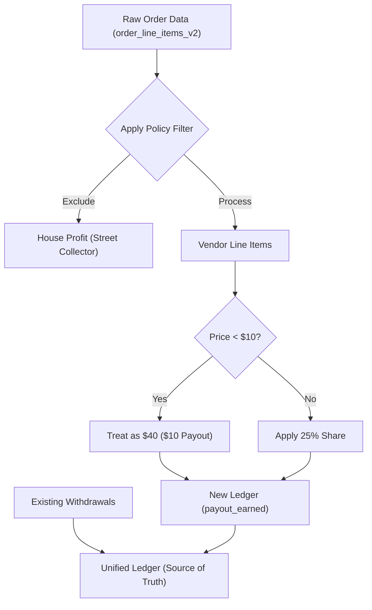

# Ledger Rebuild & Policy Alignment

This plan aligns the unified ledger with the platform's core business rules and corrects historical store pricing errors.

## 1. Objectives
- Clear incorrect `payout_earned` entries from the ledger.
- Rebuild earnings using a strict **25% share** policy.
- Exclude internal platform accounts ("Street Collector") from vendor earnings.
- **Correction Rule**: Treat any line item priced **<$10** as **$40** (resulting in a **$10** vendor payout).

## 2. Technical Specification

### SQL Migration: `supabase/migrations/20251228000004_align_ledger_to_policy.sql`
This migration will perform the following atomic operations:
1. **DELETE** all existing `payout_earned` entries from `collector_ledger_entries`.
2. **INSERT** new entries by joining `order_line_items_v2` with `vendors`.
3. **LOGIC**:
   ```sql
   INSERT INTO collector_ledger_entries (..., amount, ...)
   SELECT 
     v.auth_id, 
     'payout_earned', 
     CASE WHEN oli.price < 10 THEN 10 ELSE oli.price * 0.25 END,
     ...
   FROM order_line_items_v2 oli
   JOIN vendors v ON oli.vendor_name = v.vendor_name
   WHERE oli.fulfillment_status = 'fulfilled'
   AND oli.vendor_name NOT IN ('Street Collector', 'street collector', 'street-collector');
   ```

### Code Hardening: `[lib/banking/payout-deposit.ts](lib/banking/payout-deposit.ts)`
Update the `depositPayoutEarnings` function to ensure future orders also apply the **<$10 -> $40** correction rule.

## 3. IMPLEMENTATION CHECKLIST

1. [x] Audit all line items and project new payouts per business rules.
2. [ ] Create and apply SQL migration `20251228000004_align_ledger_to_policy.sql` to rebuild the ledger earnings.
3. [ ] Update `[lib/banking/payout-deposit.ts](lib/banking/payout-deposit.ts)` to permanently include the "Minimum $40 price" correction rule.
4. [ ] Generate final platform-wide financial health report.
5. [ ] Provide specific rundown for Carsten Gueth to confirm his balance is now exactly per policy.

## 4. Architectural Impact


