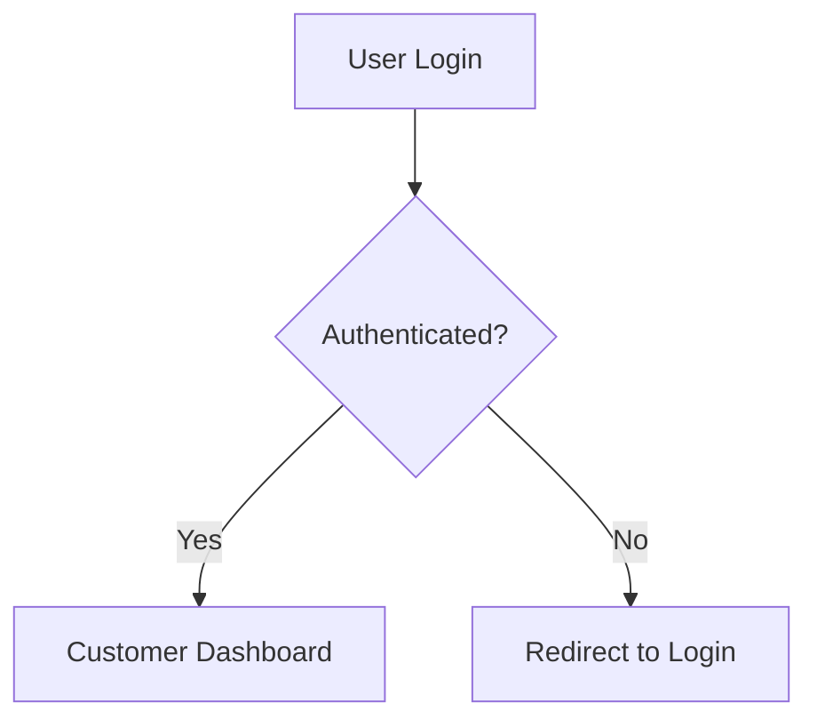

# Customer Dashboard

## 🔗 Quick Navigation
- [← Back to Project Root](/README.md)
- [Documentation Index](/docs/README.md)
- [Customer Portal Experience](/docs/customer-portal-experience.md)

## 📋 Overview
The Customer Dashboard is a central hub for users to manage their digital art collection, authenticate artworks, and explore digital experiences.

## 🏛 Architecture

### Key Components
1. **Dashboard Page**: `/app/dashboard/page.tsx`
2. **Artwork Collection**: `/components/dashboard/ArtworkCollection.tsx`
3. **Dashboard Header**: `/components/dashboard/DashboardHeader.tsx`
4. **NFC Authentication**: `/components/nfc/NFCAuthenticationWidget.tsx`
5. **Digital Experiences**: `/components/dashboard/DigitalExperiencesSection.tsx`

### Dashboard Sections
- Artwork Collection
- NFC Tag Authentication
- Digital Experiences
- User Profile

## 🔐 Authentication Flow


## 🚀 Features

### 1. Artwork Collection
- Display owned artworks
- View artwork details
- Access digital certificates
- Discover new artworks

### 2. NFC Authentication
- Scan NFC tags
- Verify artwork authenticity
- Log authentication attempts

### 3. Digital Experiences
- View exclusive content
- Access augmented reality experiences
- Explore artist interviews
- Unlock behind-the-scenes content

## 🛠 Technical Implementation

### Authentication
```typescript
interface PortalAccessControl {
  determineUserRole(user: User): UserRole
  validateAccessPermissions(role: UserRole, resource: Resource): boolean
}
```

### Performance Considerations
- Server-side rendering
- Efficient data fetching
- Lazy loading of components
- Minimal client-side JavaScript

## 🔍 Debugging and Troubleshooting
- [Performance Optimization Guide](/docs/performance-optimization.md)
- [NFC Authentication Challenges](/docs/nfc-certification-current-status.md)

## 📝 Version
**Customer Dashboard Version**: 1.0.0
**Development Stage**: Sprint 3 (Q3 2024)
**Last Updated**: [Current Date]

## 🤝 Contributing
- Follow existing component structure
- Implement role-based access control
- Write comprehensive tests
- Update documentation

## Related Documentation
- [Portal Architecture](/docs/portal-architecture.md)
- [Authentication and Permissions](/docs/authentication-permissions.md)
- [Customer Portal Experience](/docs/customer-portal-experience.md)

## Future Roadmap
- Enhanced NFC authentication
- More interactive digital experiences
- Personalized artwork recommendations
- Advanced security features

# Dashboard Routing

## Overview
This project contains multiple dashboard routes for different user roles:

### Routes
- `/pages/dashboard`: Customer Dashboard
- `/vendor/dashboard`: Vendor Dashboard
- `/admin/dashboard`: Admin Dashboard

## Routing Strategy
- Each dashboard is a separate Next.js route
- Role-based access control implemented
- Separate components for each dashboard type

## Troubleshooting
If experiencing 404 errors:
1. Verify correct route
2. Check authentication status
3. Ensure proper role assignment

## Related Documentation
- [Authentication Documentation](/docs/authentication/README.md)
- [Technical Design Overview](/docs/technical-design/overview.md) 