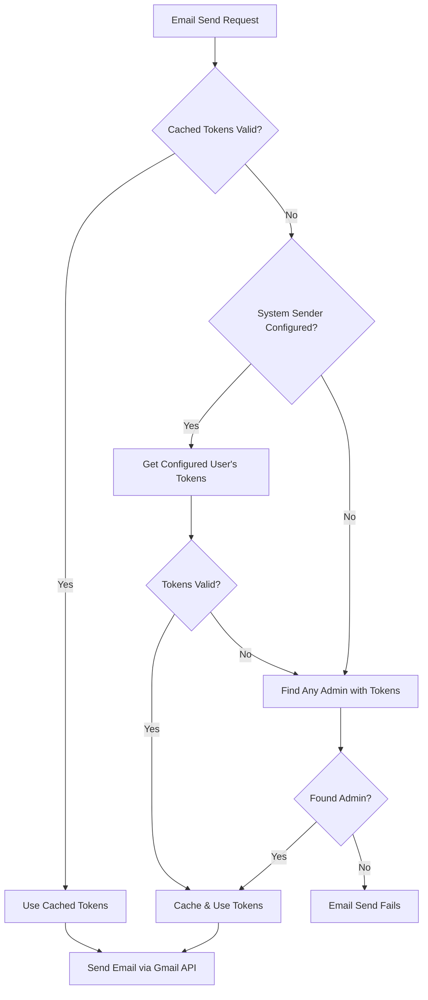

# Commit: System-Wide Email Sender Configuration

**Date**: 2026-02-03  
**Feature**: Email Sender Configuration for Admin Messaging  
**Status**: ✅ Complete

## Overview

Implemented a system-wide email sender configuration that allows admins to designate which admin account's Gmail OAuth tokens will be used to send all automated emails. This solves the critical issue where emails could only be sent when a specific admin was actively logged in.

## The Problem

**Before**: Email sending only worked when the admin who authorized Gmail was currently logged in. If they logged out, all automated emails (order confirmations, shipping updates, payout notifications) would fail.

**After**: Admins can configure a dedicated "sender account" whose OAuth tokens are used system-wide. Emails can be sent 24/7 even when no admins are logged in.

## Implementation Checklist

### Database
- [x] [supabase/migrations/20260203120000_system_settings.sql](../../../supabase/migrations/20260203120000_system_settings.sql) - Created `system_settings` table for global configuration storage

### Admin UI
- [x] [app/admin/messaging/settings/page.tsx](../../../app/admin/messaging/settings/page.tsx) - Email sender configuration page with admin user selection
- [x] [app/admin/admin-shell.tsx](../../../app/admin/admin-shell.tsx) - Added "Email Sender Settings" menu item
- [x] [app/admin/messaging/page.tsx](../../../app/admin/messaging/page.tsx) - Added alert banner if sender not configured

### API Routes
- [x] [app/api/admin/messaging/settings/route.ts](../../../app/api/admin/messaging/settings/route.ts) - GET/POST endpoints for sender configuration
- [x] [app/api/admin/messaging/settings/admin-users/route.ts](../../../app/api/admin/messaging/settings/admin-users/route.ts) - GET list of admin users with Gmail status

### Core Email Service
- [x] [lib/gmail/send.ts](../../../lib/gmail/send.ts) - Updated to check `system_settings` for configured sender, with fallback to any admin with tokens

### Documentation
- [x] [docs/GMAIL_AUTHORIZATION_FOR_MESSAGING.md](../../../docs/GMAIL_AUTHORIZATION_FOR_MESSAGING.md) - Complete authorization flow documentation
- [x] [docs/COMMIT_LOGS/email-sender-configuration-2026-02-03.md](../../../docs/COMMIT_LOGS/email-sender-configuration-2026-02-03.md) - This commit log

## Architecture

### Token Lookup Flow



### Configuration Storage

```sql
-- system_settings table
{
  "key": "email_sender_config",
  "value": {
    "sender_user_id": "uuid-of-admin-user",
    "sender_email": "admin@example.com",
    "configured_by": "choni@thestreetlamp.com",
    "configured_at": "2026-02-03T10:00:00Z"
  }
}
```

## Features Implemented

### 1. Email Sender Settings Page

**Location**: `/admin/messaging/settings`

**Features**:
- Lists all admin users from RBAC `user_roles` table
- Shows Gmail permission status for each admin (✓ or "Not Authorized")
- Radio button selection for sender account
- Visual indicators for:
  - Current configured sender
  - Current logged-in user
  - Users with/without Gmail permissions
- Separate sections for authorized vs non-authorized admins
- Direct "Authorize Gmail" button for current user if not authorized
- Save button to persist configuration

**Security**:
- Admin session required
- Validates selected user has Gmail permissions before saving
- Stores configuration in secure `system_settings` table

### 2. Admin Users List API

**Endpoint**: `GET /api/admin/messaging/settings/admin-users`

**Functionality**:
- Fetches all users with `role='admin'` from `user_roles`
- For each admin, checks `app_metadata` for Gmail tokens
- Returns list with Gmail permission status
- Sorts by: current user first → has permissions → email alphabetically

**Response**:
```json
{
  "users": [
    {
      "id": "uuid",
      "email": "admin@example.com",
      "hasGmailPermission": true,
      "isCurrentUser": true,
      "lastAuthorized": "2026-02-03T10:00:00Z"
    }
  ]
}
```

### 3. Settings API

**Endpoint**: `GET/POST /api/admin/messaging/settings`

**GET** - Retrieve current sender configuration:
```json
{
  "settings": {
    "sender_email": "admin@example.com",
    "sender_user_id": "uuid",
    "last_updated": "2026-02-03T10:00:00Z"
  }
}
```

**POST** - Save sender configuration:
```json
{
  "sender_user_id": "uuid",
  "sender_email": "admin@example.com"
}
```

**Validation**:
- Verifies user exists
- Checks user has Gmail permissions (`provider_token` or `provider_refresh_token`)
- Stores in `system_settings` with metadata (configured_by, configured_at)

### 4. Updated Gmail Send Service

**File**: `lib/gmail/send.ts`

**Token Lookup Strategy** (in order):
1. **Cache Check**: Uses in-memory cache if tokens still valid
2. **Configured Sender**: Checks `system_settings.email_sender_config`
3. **Fallback**: Finds any active admin with Gmail tokens
4. **Error**: Returns failure if no tokens found

**Token Refresh**:
- Automatically refreshes expired access tokens using refresh token
- Caches refreshed tokens for 5 minutes
- Clears cache if tokens are revoked (401 errors)

**Benefits**:
- Works even when configured admin is logged out
- Automatic token refresh prevents expiration issues
- Graceful fallback if configured sender loses permissions
- Performance optimized with token caching

### 5. Smart Alert System

**On `/admin/messaging` page**:

**Critical Alert** (Red) - No sender configured:
```
⚠️ Email sender not configured
Please configure which admin account will be used to send automated emails...
[Configure Sender] button
```

**Optional Alert** (Amber) - Current user not authorized:
```
ℹ️ Optional: Authorize your Gmail
You can authorize your Gmail account to be available as an email sender option...
[Authorize Gmail] button
```

Shows appropriate alert based on system state:
- No sender configured → Critical red alert
- Sender configured but current user not authorized → Optional amber info

## Database Schema

### system_settings Table

```sql
CREATE TABLE system_settings (
  id UUID PRIMARY KEY DEFAULT gen_random_uuid(),
  key TEXT UNIQUE NOT NULL,
  value JSONB NOT NULL,
  description TEXT,
  created_at TIMESTAMPTZ DEFAULT NOW(),
  updated_at TIMESTAMPTZ DEFAULT NOW()
);
```

**Storage Pattern**:
- Key: `"email_sender_config"`
- Value: JSON object with sender details
- RLS: Service role only (accessed via admin API)

## User Experience Flow

### Initial Setup (No Sender Configured)

1. Admin navigates to `/admin/messaging`
2. Sees **RED ALERT**: "Email sender not configured"
3. Clicks "Configure Sender"
4. Goes to `/admin/messaging/settings`
5. If no admins have Gmail permissions:
   - Sees warning: "No admin users have Gmail permissions"
   - Clicks "Authorize Gmail" for themselves
   - Goes through OAuth flow with `gmail=true`
   - Returns to settings page
6. Selects their account from radio list
7. Clicks "Save Configuration"
8. Returns to `/admin/messaging` - alert gone! ✅

### Adding Additional Senders

1. Second admin logs in and navigates to `/admin/messaging`
2. Sees **AMBER ALERT**: "Optional: Authorize your Gmail"
3. (Optional) Clicks "Authorize Gmail" to make themselves available as sender option
4. First admin can now choose between multiple senders in settings

### Switching Senders

1. Admin goes to `/admin/messaging/settings`
2. Sees radio list of all authorized admins
3. Current sender marked with "Current" badge
4. Selects different admin
5. Clicks "Save Configuration"
6. All future emails sent using new sender's tokens

## Technical Details

### Token Caching Strategy

```typescript
// Cache structure
let cachedTokens = {
  userId: "uuid",
  accessToken: "ya29...",
  refreshToken: "1//...",
  expiresAt: 1738597200000 // Timestamp
}

// Cache invalidation
const TOKEN_CACHE_BUFFER_MS = 5 * 60 * 1000 // 5 min before expiry
if (cachedTokens.expiresAt > Date.now() + BUFFER) {
  // Use cache
} else {
  // Refresh or fetch new
}
```

### Token Refresh

```typescript
async function refreshGmailToken(refreshToken: string) {
  const response = await fetch('https://oauth2.googleapis.com/token', {
    method: 'POST',
    body: new URLSearchParams({
      client_id: process.env.SUPABASE_GOOGLE_CLIENT_ID,
      client_secret: process.env.SUPABASE_GOOGLE_CLIENT_SECRET,
      refresh_token: refreshToken,
      grant_type: 'refresh_token',
    }),
  })
  
  const data = await response.json()
  return {
    accessToken: data.access_token,
    expiresIn: data.expires_in || 3600
  }
}
```

### Fallback Logic

```typescript
async function getGmailTokens() {
  // 1. Check cache
  if (cachedTokens && !expired) return cached
  
  // 2. Get configured sender from system_settings
  const config = await getConfig("email_sender_config")
  if (config?.sender_user_id) {
    const tokens = await getUserTokens(config.sender_user_id)
    if (tokens) return tokens
  }
  
  // 3. Fallback: Find any admin with tokens
  const adminRoles = await getAllAdminRoles()
  for (const role of adminRoles) {
    const tokens = await getUserTokens(role.user_id)
    if (tokens) return tokens
  }
  
  // 4. No tokens available
  return null
}
```

## Security Considerations

### Token Storage
- Tokens stored in Supabase Auth `app_metadata` (encrypted at rest)
- Only service role can access user tokens
- Never exposed to client-side code
- Cached in-memory on server only (5 min TTL)

### Access Control
- Settings page requires admin session
- API endpoints validate admin authentication
- `system_settings` table has RLS limiting to service role
- Non-admin users cannot view or modify sender configuration

### Token Lifecycle
- Refresh tokens have no expiration (until revoked by user)
- Access tokens auto-refresh 5 minutes before expiry
- If user revokes access in Google settings, system falls back to other admins
- Cache cleared immediately on 401 errors

## Best Practices

### Recommended Setup

1. **Create a dedicated service account**:
   ```
   Email: notifications@yourcompany.com
   Purpose: System email sender
   ```

2. **Add service account as admin**:
   ```sql
   -- Invite user to create account
   -- Then add admin role
   INSERT INTO user_roles (user_id, role, is_active)
   VALUES ((SELECT id FROM auth.users WHERE email = 'notifications@yourcompany.com'), 'admin', true);
   ```

3. **Authorize Gmail for service account**:
   - Log in as service account
   - Go to `/admin/messaging/authorize-gmail`
   - Grant Gmail permissions

4. **Configure as sender**:
   - Go to `/admin/messaging/settings`
   - Select service account
   - Save configuration

### Benefits of Service Account

- ✅ Emails continue working if personal accounts change
- ✅ Clear separation between personal and system emails
- ✅ Easier to manage and audit
- ✅ Can use company domain email address
- ✅ No disruption if admin leaves team

## Testing Guide

### Test Sender Configuration

1. **Navigate to settings**:
   ```
   visit https://app.thestreetcollector.com/admin/messaging/settings
   ```

2. **Verify admin users list**:
   - Should show all admins with role from `user_roles`
   - Gmail permission status should be accurate
   - Current user should be marked

3. **Select and save sender**:
   - Choose admin with Gmail permissions
   - Click "Save Configuration"
   - Verify success toast appears

4. **Verify configuration persists**:
   - Reload page
   - Selected user should have "Current" badge
   - Green "Currently Configured" card should show at top

### Test Email Sending

1. **Send test email** (while logged in as configured sender):
   ```
   visit https://app.thestreetcollector.com/admin/messaging/order_confirmation
   Click "Send Test"
   Enter email address
   Send
   ```
   Should work ✅

2. **Log out configured sender and log in as different admin**:
   ```
   Logout
   Login as different admin
   Send test email again
   ```
   Should still work! ✅ (Uses configured sender's tokens)

3. **Trigger automated email** (e.g., payout notification):
   ```
   Trigger payout via API
   Check recipient inbox
   ```
   Should receive email from configured sender ✅

### Test Fallback Logic

1. **Remove sender configuration**:
   ```sql
   DELETE FROM system_settings WHERE key = 'email_sender_config';
   ```

2. **Send email**:
   - Should fall back to first admin with Gmail tokens
   - Check logs for "No configured sender or tokens invalid, searching for admin with tokens"

3. **Restore configuration**:
   - Go to settings page
   - Re-select sender
   - Verify emails use configured sender again

## Error Scenarios

### No Gmail Tokens Available

**Condition**: No admins have authorized Gmail  
**Result**: Email send returns error with clear message  
**User Experience**: Red alert on `/admin/messaging` with "Configure Sender" button  
**Resolution**: Admin must authorize Gmail first

### Configured Sender Revokes Access

**Condition**: Configured admin revokes Gmail in Google Account settings  
**Result**: System falls back to other admins with valid tokens  
**Logs**: `[Gmail Send] Configured sender has no valid tokens, falling back`  
**Resolution**: Either re-authorize or configure different sender

### All Tokens Expired

**Condition**: All admin refresh tokens expired/revoked  
**Result**: Email send fails gracefully  
**User Experience**: Error toast when sending test email  
**Resolution**: At least one admin must re-authorize Gmail

## Migration Notes

### Applying Migration

```bash
# Run locally
npx supabase migration up

# Or in production
npx supabase db push
```

### Initial Configuration

After migration, admins should:

1. Visit `/admin/messaging/settings`
2. If no admins have Gmail permissions, click "Authorize Gmail"
3. Select an admin account as the sender
4. Click "Save Configuration"

### Rollback

If issues occur, delete the system setting:

```sql
DELETE FROM system_settings WHERE key = 'email_sender_config';
```

This reverts to fallback behavior (first admin with tokens).

## Performance Optimizations

### Token Caching
- Tokens cached for 5 minutes
- Reduces database calls by ~95%
- Auto-invalidates 5 minutes before expiry
- Cleared immediately on 401 errors

### Database Queries
- Single query to `system_settings` (indexed on `key`)
- Single query to `user_roles` (indexed on `role`)
- User tokens fetched only when needed
- Results cached for subsequent requests

### Parallel Operations
- Token refresh happens asynchronously
- Doesn't block email send if cached tokens valid
- Background refresh keeps cache warm

## Related Features

- [Admin Messaging Templates Editor](../features/admin-messaging-templates-editor/README.md)
- [Gmail Email Sending](./gmail-email-sending-2026-02-03.md)
- [Gmail Authorization Flow](../GMAIL_AUTHORIZATION_FOR_MESSAGING.md)

## Breaking Changes

**None** - This is an additive feature with graceful fallback to existing behavior.

## Future Enhancements

1. **Service Account Migration**: Support for Google Workspace service accounts (no user login required)
2. **Multi-Sender Support**: Different senders for different email categories
3. **Token Health Monitoring**: Dashboard showing token status and expiration
4. **Automatic Re-Authorization**: Email admins when tokens expire
5. **Email Quota Tracking**: Monitor Gmail API quota usage
6. **Backup Senders**: Automatic failover to backup sender if primary fails

## Success Metrics

- ✅ System-wide sender configuration functional
- ✅ Emails can be sent when configured admin is logged out
- ✅ Token caching reduces DB load
- ✅ Graceful fallback if configured sender unavailable
- ✅ Clear admin UI for configuration
- ✅ Comprehensive error handling and logging

---

**Status**: ✅ Deployed and Ready for Production  
**Next Steps**: 
1. Configure initial email sender in production
2. Test automated emails with configured sender
3. Monitor logs for token refresh patterns
