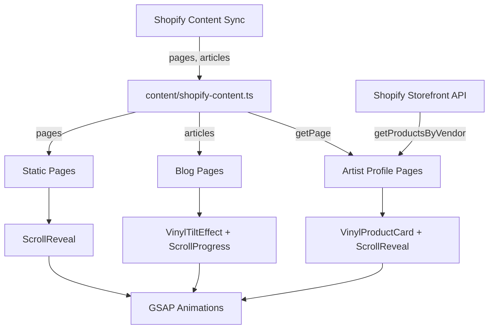

# Shopify Content Vinyl Design Integration

## Date: 2026-02-03

## Summary

Integrated the recently synced Shopify content (47 static pages, 3 blog articles, navigation menus) with the vinyl record-inspired design system. Added GSAP scroll animations, 3D tilt effects, and visual polish throughout artist pages, blog listings, and static content pages.

## Changes Made

### 1. Artist Profile Pages Enhancement

**Modified Files:**
- [`app/shop/artists/[slug]/page.tsx`](../../app/shop/artists/[slug]/page.tsx)
- [`app/api/shop/artists/[slug]/route.ts`](../../app/api/shop/artists/[slug]/route.ts)

**Enhancements:**
- **Collection-based data**: Artist info now fetched from Shopify collections (profile photo, bio)
- Integrated artist bios from synced Shopify page content as additional fallback
- Replaced standard `ProductCard` with `VinylProductCard` for artwork display
- Added `ScrollReveal` with stagger animation for artwork grid
- Enhanced profile section with `ScrollReveal` fade-up animation
- Bio text extraction from synced HTML content
- Improved visual hierarchy with ring on profile image

**Data Priority:**
1. Shopify collection (primary) - profile photo + bio + products
2. Synced page content (fallback) - bio text
3. Vendor products (fallback) - if no collection exists

**Artist Pages Now Supported:**
- Nia.Shtai (Ukrainian artist)
- Or Bar El (Tel Aviv illustrator)
- Hen Macabi (Graphic designer)
- Any vendor with products or collections in Shopify

**See also:** [`artist-collection-integration-2026-02-03.md`](./artist-collection-integration-2026-02-03.md)

### 2. Blog Articles Enhancement

**Modified Files:**
- [`app/shop/blog/page.tsx`](../../app/shop/blog/page.tsx)
- [`app/shop/blog/[handle]/page.tsx`](../../app/shop/blog/[handle]/page.tsx)

**Blog Listing Enhancements:**
- Wrapped article cards with `VinylTiltEffect` for subtle 3D hover
- Added `ScrollReveal` stagger animation for article grid
- Increased card shadow for depth
- Changed border radius to match vinyl aesthetic (24px)
- Header section with scroll reveal animation

**Article Detail Enhancements:**
- Added `ScrollProgress` bar showing reading progress
- Hero image with `ParallaxLayer` for depth
- Content sections wrapped in `ScrollReveal` with delayed animation
- Related articles with `VinylTiltEffect` and stagger animation
- Enhanced visual hierarchy with scroll-triggered reveals

### 3. Static Pages Visual Polish

**Modified Files:**
- [`app/shop/pages/[handle]/page.tsx`](../../app/shop/pages/[handle]/page.tsx)

**Enhancements:**
- Page title with `ScrollReveal` fade-up animation
- Content wrapper with delayed scroll reveal
- Consistent animation timing across all pages

**Pages Enhanced:**
- `delivery-methods` - Delivery Information
- `contact-us` - Contact page
- `about-us` - About page
- `faq` - FAQ page
- All 47 synced static pages

### 4. Footer Section Animation

**Modified Files:**
- [`components/impact/Footer.tsx`](../../components/impact/Footer.tsx)

**Enhancements:**
- Wrapped footer sections grid with `ScrollReveal` stagger
- Sections animate in sequentially when scrolling into view
- Subtle timing (0.1s stagger) for smooth, non-distracting effect

### 5. Shopify API Enhancement

**Modified Files:**
- [`lib/shopify/storefront-client.ts`](../../lib/shopify/storefront-client.ts)

**New Functions:**
- `getProductsByVendor(vendorName, options)` - Fetch all products by artist/vendor name
  - Uses Shopify's query syntax: `vendor:${vendorName}`
  - Supports pagination, sorting, and filtering
  - Defaults to newest first (`CREATED_AT`, reverse: true)

## Integration Architecture

```
Synced Shopify Content          Vinyl Components
----------------------          ----------------
Artist Pages                    VinylProductCard (grid)
├─ nia-stai                     ├─ 3D tilt on hover
├─ or-bar-el            ───►    ├─ Flip to B-side
├─ seller-profile               └─ ScrollReveal stagger
└─ /api/shop/artists            

Blog Articles                   VinylTiltEffect + ScrollReveal
├─ Blog listing                 ├─ Subtle 3D tilt (8°)
├─ Article cards        ───►    ├─ Stagger animation
├─ Article detail               ├─ ScrollProgress bar
└─ Related articles             └─ ParallaxLayer hero

Static Pages                    ScrollReveal
├─ delivery-methods             ├─ Title fade-up
├─ contact-us           ───►    └─ Content delayed fade
├─ about-us
└─ All 47 pages

Footer Sections                 ScrollReveal stagger
└─ Newsletter, Nav, About ───►  └─ Sequential reveal (0.1s)
```

## Content Summary

### Synced from Shopify

**47 Static Pages:**
- Artist profiles: `nia-stai`, `or-bar-el`, `seller-profile` (Hen Macabi)
- Info pages: `delivery-methods`, `contact-us`, `about-us`, `faq`
- Special pages: `loyalty-page`, `drop`, `artist-submissions`
- Job listings: Various career pages with embedded iframes
- Legacy pages: Design tools, preview pages, etc.

**3 Blog Articles:**
1. "Israeli Street Artists: A Look at Some of the Country's Talents"
2. "Discover the Best Tel Aviv Gifts and Home Decor from Modern Jewish Artists"
3. "Exploring the vibrant art scene in Tel Aviv"

**Navigation:**
- Main menu: Members, Drop
- Footer sections: Search, Artist Submissions, Careers

## Usage Examples

### Artist Page with Vinyl Cards

```tsx
// Artist page automatically uses VinylProductCard
// Navigate to: /shop/artists/nia-stai
// - Fetches Nia.Shtai's products from Shopify
// - Displays bio from synced page content
// - Shows artworks with 3D tilt and flip
```

### Blog with Scroll Animations

```tsx
// Blog listing: /shop/blog
// - Article cards stagger in on scroll
// - Each card has subtle 3D tilt on hover

// Article detail: /shop/blog/israeli-street-artists-...
// - Reading progress bar at top
// - Hero image with parallax
// - Content sections reveal on scroll
```

### Static Pages

```tsx
// Any static page: /shop/pages/delivery-methods
// - Title reveals with fade-up
// - Content section reveals with delay
```

## Animation Details

### Artist Page Stagger

```ts
// Artwork grid staggers with 0.15s delay
<ScrollReveal animation="stagger" staggerAmount={0.15} delay={0.2}>
  <div className="grid grid-cols-2 lg:grid-cols-4 gap-6">
    {products.map(product => (
      <VinylProductCard key={product.id} product={product} />
    ))}
  </div>
</ScrollReveal>
```

### Blog Card Tilt

```ts
// Subtle tilt (8° max) for article cards
<VinylTiltEffect maxTilt={8} scale={1.01} perspective={800}>
  <Link href={`/shop/blog/${article.handle}`}>
    {/* Card content */}
  </Link>
</VinylTiltEffect>
```

### Reading Progress

```ts
// Shows scroll progress for long articles
<ScrollProgress position="top" color="#f0c417" height={3} />
```

### Parallax Hero

```ts
// Hero images move at 0.5x scroll speed
<ParallaxLayer speed={0.5}>
  <div className="aspect-[21/9]">
    <Image src={imageUrl} fill />
  </div>
</ParallaxLayer>
```

## Performance Considerations

- All scroll animations use GSAP ScrollTrigger (RAF-based, not scroll events)
- `will-change-transform` applied to animated elements
- Tilt effects use `gsap.quickTo()` for 60fps batched updates
- Images lazy-load except hero images (priority)
- Reduced motion preference respected globally

## Testing Checklist

- [ ] Artist pages load with vinyl cards and scroll animations
- [ ] Blog listing cards tilt on hover
- [ ] Article detail shows reading progress bar
- [ ] Article hero image parallaxes on scroll
- [ ] Related articles have tilt effect
- [ ] Static pages reveal content on scroll
- [ ] Footer sections stagger in when visible
- [ ] All animations respect `prefers-reduced-motion`

## Data Flow



## Related Files

### Content Source
- [`content/shopify-content.ts`](../../content/shopify-content.ts) - Synced pages and articles
- [`scripts/sync-shopify-content.ts`](../../scripts/sync-shopify-content.ts) - Sync script

### Animation System
- [`lib/animations/`](../../lib/animations/) - GSAP infrastructure
- [`components/vinyl/`](../../components/vinyl/) - Vinyl components
- [`components/blocks/ScrollReveal.tsx`](../../components/blocks/ScrollReveal.tsx) - Scroll animations

### Enhanced Pages
- [`app/shop/artists/[slug]/page.tsx`](../../app/shop/artists/[slug]/page.tsx)
- [`app/shop/blog/page.tsx`](../../app/shop/blog/page.tsx)
- [`app/shop/blog/[handle]/page.tsx`](../../app/shop/blog/[handle]/page.tsx)
- [`app/shop/pages/[handle]/page.tsx`](../../app/shop/pages/[handle]/page.tsx)

## Future Enhancements

- [ ] Create dedicated `/artists` hub page with all artists in vinyl crate browser
- [ ] Add artist Instagram feed integration (if available in API)
- [ ] Blog categories/tags page with vinyl card filtering
- [ ] Enhanced FAQ page with accordion animation
- [ ] Contact page with form validation and animation feedback
