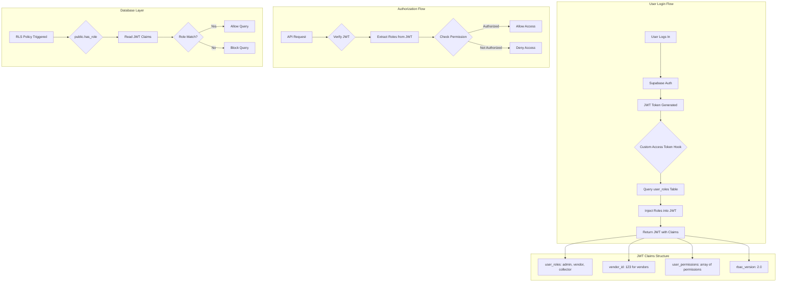
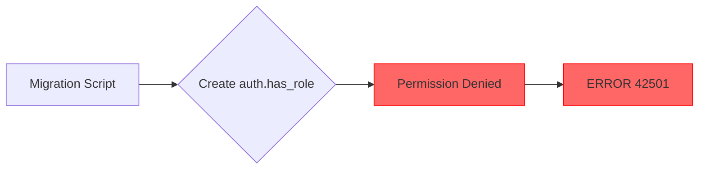
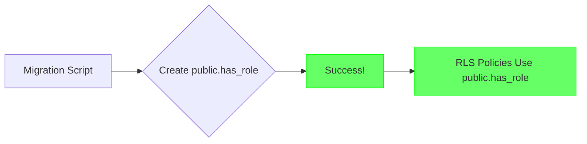
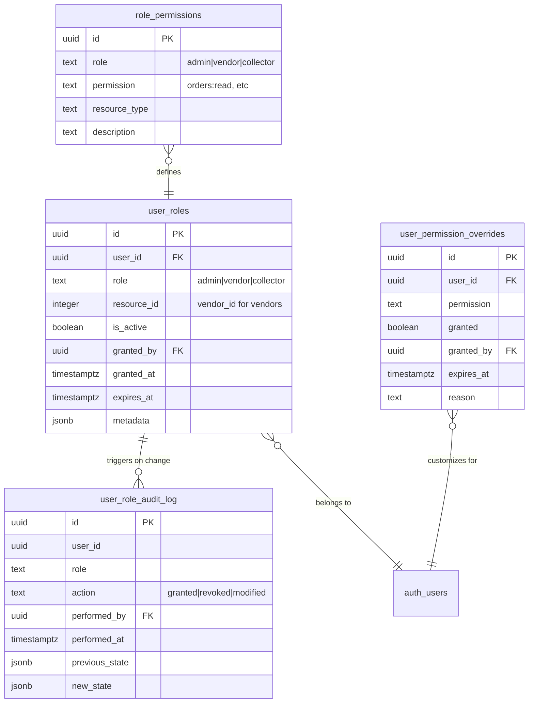
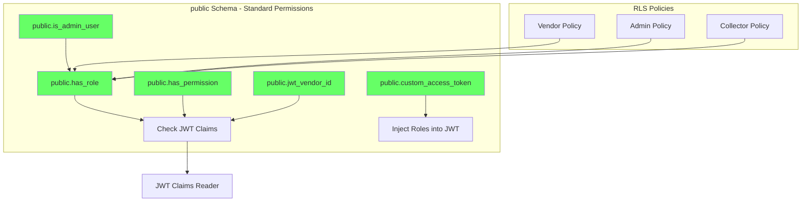
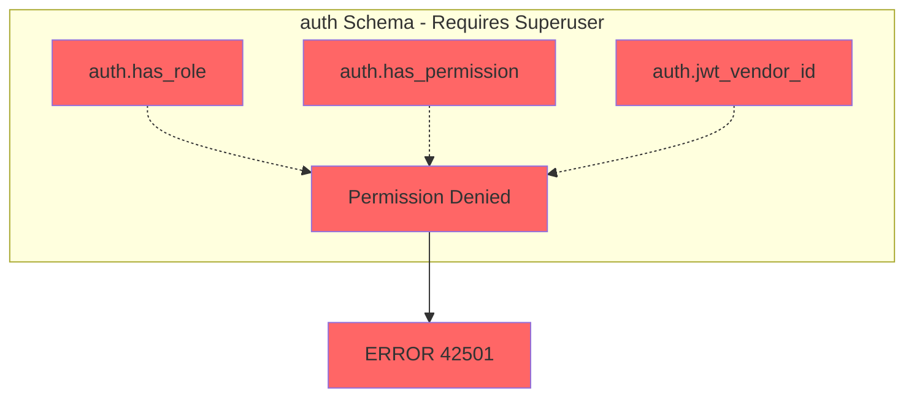
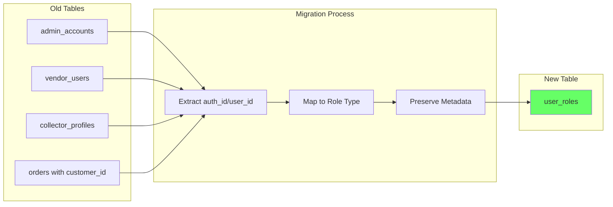
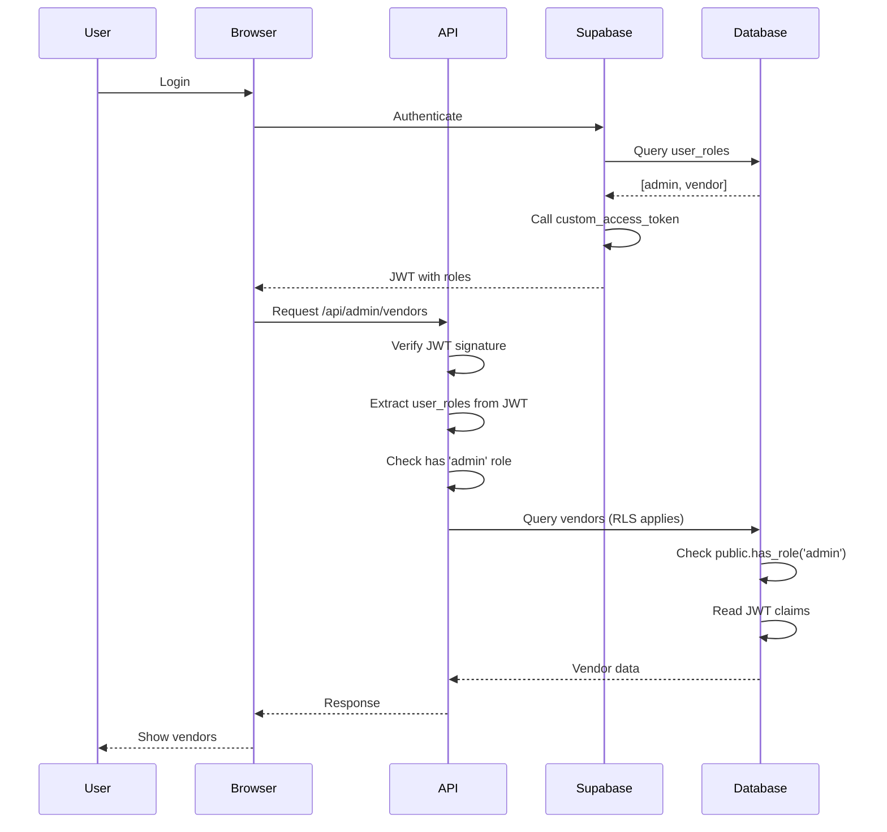
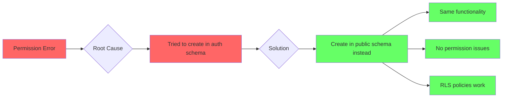

# RBAC System Architecture

## System Overview



## Permission Error - Before vs After

### ❌ Before (Broken)



**Problem:** Cannot create functions in `auth` schema without superuser privileges

### ✅ After (Fixed)



**Solution:** Create functions in `public` schema (works for all users)

## Database Schema



## Function Architecture

### Public Schema Functions (✅ Used in Fixed Version)



### Auth Schema Attempt (❌ Causes Permission Error)



## RLS Policy Examples

### Using public.has_role (✅ Works)

```sql
CREATE POLICY "Admins can access all vendors"
  ON public.vendors FOR ALL
  USING (public.has_role('admin'));
```

### Using auth.has_role (❌ Requires Creating Function First)

```sql
-- This would work IF we could create auth.has_role
-- But we can't without superuser permissions
CREATE POLICY "Admins can access all vendors"
  ON public.vendors FOR ALL
  USING (auth.has_role('admin'));  -- ❌ Function doesn't exist
```

## JWT Token Structure

### Before RBAC (Old System)

```json
{
  "sub": "user-uuid",
  "email": "user@example.com",
  "role": "authenticated",
  "aud": "authenticated"
}
```

**Problem:** No role information, had to check cookies

### After RBAC (New System)

```json
{
  "sub": "user-uuid",
  "email": "user@example.com",
  "role": "authenticated",
  "aud": "authenticated",
  "user_roles": ["admin", "vendor"],
  "vendor_id": 123,
  "user_permissions": [
    "admin:all",
    "vendors:manage",
    "products:create",
    "products:edit"
  ],
  "rbac_version": "2.0"
}
```

**Benefit:** All role info in JWT, no database queries needed

## Migration Data Flow



## Access Control Flow



## Security Comparison

| Feature | Old System | New System |
|---------|------------|------------|
| **Admin Detection** | ❌ Hardcoded emails | ✅ Database roles |
| **Session Management** | ❌ 3 separate cookies | ✅ Single JWT |
| **Role Storage** | ❌ 3 different tables | ✅ Unified user_roles |
| **Permission Checks** | ❌ Manual in code | ✅ Automatic via RLS |
| **Audit Trail** | ❌ None | ✅ Complete audit log |
| **Role Changes** | ❌ Code changes required | ✅ Database update |
| **Multi-role Support** | ❌ No | ✅ Yes |
| **Testing** | ❌ Difficult | ✅ Easy (mock JWT) |

## Function Call Stack

### API Request Flow

```mermaid
graph TB
    A[withAdmin middleware] --> B[Extract JWT from request]
    B --> C[Verify JWT signature]
    C --> D[Parse JWT claims]
    D --> E{Check user_roles contains 'admin'}
    E -->|Yes| F[Call handler with user context]
    E -->|No| G[Return 403 Forbidden]
    
    F --> H[Handler accesses database]
    H --> I{RLS Policy Triggered}
    I --> J[public.has_role('admin')]
    J --> K[Read request.jwt.claims]
    K --> L{admin in user_roles?}
    L -->|Yes| M[Allow query]
    L -->|No| N[Block query]
    
    style E fill:#ffa
    style L fill:#ffa
    style M fill:#6f6
    style N fill:#f66
    style G fill:#f66
```

## Schema Permissions Comparison

| Operation | auth Schema | public Schema |
|-----------|-------------|---------------|
| CREATE FUNCTION | ❌ Superuser only | ✅ Standard user |
| DROP FUNCTION | ❌ Superuser only | ✅ Owner/Standard user |
| EXECUTE FUNCTION | ✅ Yes (if granted) | ✅ Yes (if granted) |
| Use in RLS | ✅ Yes | ✅ Yes |
| Security Context | Same | Same (with SECURITY DEFINER) |

**Key Insight:** The `auth` schema is managed by Supabase and requires elevated privileges to modify. The `public` schema is owned by your project and allows standard operations.

## Summary

### The Fix in One Diagram



### Key Takeaways

1. ✅ **Functions in `public` schema** - No permission issues
2. ✅ **Same security level** - `SECURITY DEFINER` provides same context
3. ✅ **Works with RLS** - Policies can call `public.has_role()`
4. ✅ **Standard permissions** - Any database user can create
5. ✅ **Production ready** - Used by Supabase community

---

**Conclusion:** The fix is simple and safe - use `public` schema instead of `auth` schema. Functionality remains identical, but without permission errors.
