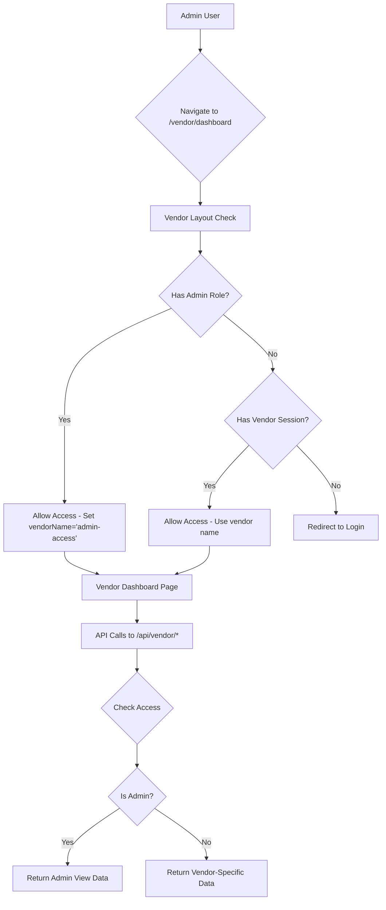

# Admin Access to Vendor Dashboard

## Overview

This feature allows admin users to access the vendor dashboard using their admin privileges, without needing a separate vendor role assignment.

## Implementation Date
January 27, 2026

## Changes Made

### 1. Vendor Layout (`app/vendor/layout.tsx`)
- **Modified**: Admin detection and access control
- **Behavior**: 
  - Admins can now access `/vendor/dashboard` routes
  - Admin users are identified via RBAC `getUserContext` and `hasRole` checks
  - Admins bypass vendor-specific database checks
  - Sets `vendorName = "admin-access"` for admin users

### 2. Vendor Session Helper (`lib/vendor-session-with-admin.ts`)
- **Created**: New helper module for vendor/admin access checking
- **Functions**:
  - `getVendorOrAdminAccess()`: Checks for vendor session OR admin role
  - `getVendorNameForQuery()`: Returns vendor name for filtering, or null for admins
- **Usage**: Replace `getVendorFromCookieStore()` in vendor API routes

### 3. Vendor API Routes Updated

#### Profile Route (`app/api/vendor/profile/route.ts`)
- **Modified**: Uses `getVendorOrAdminAccess` helper
- **Admin Behavior**: Returns placeholder profile with `is_admin: true`

#### Stats Route (`app/api/vendor/stats/route.ts`)
- **Modified**: Uses `getVendorOrAdminAccess` helper
- **Admin Behavior**: Returns empty/aggregate stats with `isAdmin: true` flag

#### Sales Analytics Route (`app/api/vendor/sales-analytics/route.ts`)
- **Modified**: Uses `getVendorOrAdminAccess` helper
- **Admin Behavior**: Returns empty analytics with `isAdmin: true` flag

## Access Flow



## Usage

### For Admin Users
1. Log in with admin credentials
2. Navigate to `/vendor/dashboard`
3. Access vendor dashboard with admin privileges
4. Currently shows placeholder/aggregate data
5. Future enhancement: Vendor selector for viewing specific vendor data

### For Vendor API Routes
To update other vendor API routes to support admin access:

```typescript
// Old way
import { getVendorFromCookieStore } from "@/lib/vendor-session"

const vendorName = getVendorFromCookieStore(cookieStore)
if (!vendorName) {
  return NextResponse.json({ error: "Not authenticated" }, { status: 401 })
}

// New way
import { getVendorOrAdminAccess } from "@/lib/vendor-session-with-admin"

const access = await getVendorOrAdminAccess(cookieStore)
if (!access.hasAccess) {
  return NextResponse.json({ error: "Not authenticated" }, { status: 401 })
}

if (access.isAdmin) {
  // Handle admin case - return all vendors' data or aggregate
} else {
  // Handle vendor case - use access.vendorName
}
```

## Future Enhancements

1. **Vendor Selector for Admins**
   - Add UI component for admins to select which vendor to view
   - Store selection in session/state
   - Filter data based on selected vendor

2. **Aggregate Dashboard View**
   - Show combined stats for all vendors
   - Platform-wide analytics for admins
   - Comparative vendor performance metrics

3. **Multi-Vendor Management**
   - Allow admins to switch between vendor contexts
   - Breadcrumb navigation showing current vendor context
   - "View as Vendor" feature for testing

4. **Complete Vendor API Coverage**
   - Update remaining 70+ vendor API routes to support admin access
   - Batch migration script for consistent implementation
   - Automated testing for admin access on all routes

## Testing Checklist

- [x] Admin can access `/vendor/dashboard`
- [x] Admin is not redirected to admin dashboard from vendor routes
- [x] Vendor layout allows admin access
- [x] Profile API returns admin placeholder
- [x] Stats API returns admin data
- [x] Sales analytics API returns admin data
- [ ] Test with actual admin user credentials
- [ ] Verify no regression for regular vendor users
- [ ] Test error handling for invalid access

## Related Files

- `app/vendor/layout.tsx` - Vendor layout with admin support
- `lib/vendor-session-with-admin.ts` - Access checking helper
- `app/api/vendor/profile/route.ts` - Profile endpoint
- `app/api/vendor/stats/route.ts` - Stats endpoint
- `app/api/vendor/sales-analytics/route.ts` - Analytics endpoint
- `lib/rbac/index.ts` - RBAC system
- `lib/rbac/middleware.ts` - RBAC middleware

## Security Considerations

1. **Admin Verification**: Uses RBAC system to verify admin role via JWT claims
2. **No Role Escalation**: Admins use existing admin privileges, not vendor role
3. **Audit Trail**: All admin actions logged via RBAC audit system
4. **RLS Policies**: Database RLS policies respect admin permissions
5. **Separation of Concerns**: Admin and vendor access paths are clearly separated

## Known Limitations

1. Admin users currently see placeholder/empty data for stats and analytics
2. No vendor selector UI implemented yet
3. Not all 70+ vendor API routes updated to support admin access
4. Admin users cannot perform vendor-specific actions that require vendor_id

## Migration Notes

- **Backward Compatible**: Existing vendor users not affected
- **No Database Changes**: Uses existing RBAC system
- **No Breaking Changes**: Vendor session cookies still work as before
- **Incremental Rollout**: Can update vendor API routes gradually

## Version History

- **v1.0** (2026-01-27): Initial implementation
  - Vendor layout admin support
  - Helper function creation
  - Profile, stats, and analytics API updates
