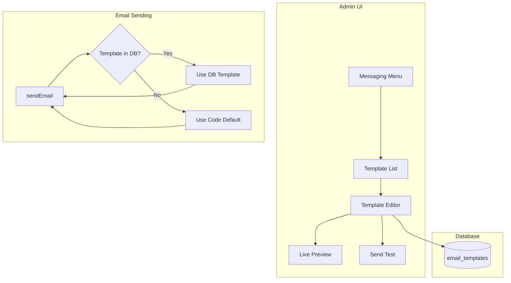

# Admin Messaging Templates Editor

## Overview

The Admin Messaging Templates Editor is a powerful feature that allows administrators to view, edit, preview, and test all automated email templates sent by the platform. This includes order confirmations, shipping updates, payout notifications, and welcome emails.

## Features

- **Visual Template Editor**: Edit email subject lines and HTML bodies with live preview
- **Variable Insertion**: Click-to-insert dynamic variables like `{{customerName}}`, `{{orderName}}`, etc.
- **Live Preview**: Real-time preview of emails with sample data
- **Test Email Sending**: Send test emails to verify formatting and content
- **Enable/Disable Templates**: Toggle individual templates on/off
- **Reset to Default**: Restore templates to their original code-based versions
- **Category Organization**: Templates organized by category (order, shipping, payout, welcome)

## Architecture



## Database Schema

The `email_templates` table stores customizable email templates:

```sql
CREATE TABLE email_templates (
  id UUID PRIMARY KEY DEFAULT gen_random_uuid(),
  template_key TEXT UNIQUE NOT NULL,      -- e.g., 'order_confirmation'
  name TEXT NOT NULL,                      -- Display name
  description TEXT,                        -- What triggers this email
  category TEXT NOT NULL,                  -- 'order', 'shipping', 'payout', 'welcome'
  subject TEXT NOT NULL,                   -- Email subject (supports variables)
  html_body TEXT NOT NULL,                 -- HTML template (supports variables)
  variables JSONB DEFAULT '[]',            -- Available variables for this template
  enabled BOOLEAN DEFAULT true,
  created_at TIMESTAMPTZ DEFAULT NOW(),
  updated_at TIMESTAMPTZ DEFAULT NOW()
);
```

## Template Variables System

Templates support Mustache-style variable interpolation:

### Syntax
- Variables use double curly braces: `{{variableName}}`
- Example: `"Hello {{customerName}}, your order {{orderName}} is ready!"`

### Variable Rendering
The template service (`lib/email/template-service.ts`) handles variable replacement:

```typescript
const template = await renderTemplate('order_confirmation', {
  customerName: 'John',
  orderName: '#1234',
  trackingUrl: 'https://app.thestreetcollector.com/track/abc123'
})
// Returns: { subject: "Order Confirmed - #1234", html: "...", fromTemplate: true }
```

## Supported Templates

| Template Key                | Category | Trigger              |
| --------------------------- | -------- | -------------------- |
| `order_confirmation`        | Order    | New paid order       |
| `shipping_shipped`          | Shipping | Order ships          |
| `shipping_in_transit`       | Shipping | Package in transit   |
| `shipping_out_for_delivery` | Shipping | Out for delivery     |
| `shipping_delivered`        | Shipping | Package delivered    |
| `shipping_alert`            | Shipping | Delivery issue       |
| `payout_processed`          | Payout   | Payout successful    |
| `payout_failed`             | Payout   | Payout failed        |
| `payout_pending`            | Payout   | Payout reminder      |
| `refund_deduction`          | Payout   | Refund processed     |
| `collector_welcome`         | Welcome  | New collector signup |

## Components

### 1. TemplateEditor

Located: `app/admin/messaging/components/TemplateEditor.tsx`

Provides the main editing interface with:
- Subject line input
- Variable insertion buttons
- HTML body textarea
- Enable/disable toggle
- Save, Reset, and Send Test actions

**Props:**
```typescript
{
  template: EmailTemplate
  subject: string
  htmlBody: string
  enabled: boolean
  hasChanges: boolean
  saving: boolean
  onSubjectChange: (value: string) => void
  onHtmlBodyChange: (value: string) => void
  onEnabledChange: (value: boolean) => void
  onSave: () => void
  onReset: () => void
  onSendTest: () => void
  onInsertVariable: (variableName: string) => void
}
```

### 2. TemplatePreview

Located: `app/admin/messaging/components/TemplatePreview.tsx`

Displays live preview with:
- Rendered subject line
- HTML preview iframe
- Sample data variables display

**Props:**
```typescript
{
  preview: {
    subject: string
    html: string
    sampleData: Record<string, string>
  } | null
  loading: boolean
}
```

### 3. TestEmailForm

Located: `app/admin/messaging/components/TestEmailForm.tsx`

Modal dialog for sending test emails:
- Email address input
- Send button with loading state
- Success/error toast notifications

**Props:**
```typescript
{
  templateKey: string
  open: boolean
  onOpenChange: (open: boolean) => void
}
```

## API Endpoints

### GET `/api/admin/messaging/templates`
List all email templates.

**Response:**
```json
{
  "templates": [
    {
      "id": "uuid",
      "template_key": "order_confirmation",
      "name": "Order Confirmation",
      "category": "order",
      "enabled": true,
      "updated_at": "2026-02-03T10:00:00Z"
    }
  ]
}
```

### GET `/api/admin/messaging/templates/[key]`
Get a specific template with default fallback.

**Response:**
```json
{
  "template": { /* EmailTemplate */ },
  "defaultTemplate": {
    "subject": "...",
    "html": "..."
  }
}
```

### PUT `/api/admin/messaging/templates/[key]`
Update a template.

**Request Body:**
```json
{
  "subject": "Updated Subject - {{orderName}}",
  "html_body": "<html>...</html>",
  "enabled": true
}
```

### POST `/api/admin/messaging/templates/[key]/test`
Send a test email.

**Request Body:**
```json
{
  "email": "test@example.com"
}
```

### POST `/api/admin/messaging/templates/[key]/preview`
Generate preview with sample data.

**Request Body:**
```json
{
  "subject": "...",
  "html_body": "..."
}
```

**Response:**
```json
{
  "preview": {
    "subject": "Order Confirmed - #1234",
    "html": "<html>...</html>",
    "sampleData": {
      "customerName": "John",
      "orderName": "#1234"
    }
  }
}
```

## Email Notification Integration

### Order Confirmation
```typescript
// lib/notifications/order-confirmation.ts
import { renderTemplate } from '@/lib/email/template-service'

const template = await renderTemplate('order_confirmation', {
  customerName: customer.name,
  orderName: order.name,
  trackingUrl: `https://app.thestreetcollector.com/track/${token}`
})

await sendEmail({
  to: customer.email,
  subject: template.subject,
  html: template.html
})
```

### Shipping Updates
```typescript
// lib/notifications/tracking-link.ts
import { renderTemplate, SHIPPING_STAGE_TO_TEMPLATE } from '@/lib/email/template-service'

const templateKey = SHIPPING_STAGE_TO_TEMPLATE[stage] // Maps stage to template key

const template = await renderTemplate(templateKey, {
  orderName: order.name,
  recipientName: customer.name,
  trackingNumber: tracking.number,
  trackingUrl: `https://app.thestreetcollector.com/track/${token}`
})
```

### Payout Notifications
```typescript
// lib/notifications/payout-notifications.ts
import { renderTemplate } from '@/lib/email/template-service'

const template = await renderTemplate('payout_processed', {
  vendorName: vendor.name,
  amount: '$1,234.56',
  reference: 'PAY-2024-001234'
})

await sendEmail({
  to: vendor.email,
  subject: template.subject,
  html: template.html
})
```

## Testing Guide

### 1. Template List View
1. Navigate to `/admin/messaging`
2. Verify all templates are displayed
3. Check category grouping and status badges
4. Test search/filter functionality

### 2. Template Editor
1. Click a template to open the editor
2. Modify subject line and verify live preview updates
3. Click variable buttons to insert into HTML body
4. Test enable/disable toggle
5. Make changes and verify "Unsaved changes" badge appears
6. Click Save and verify success toast

### 3. Live Preview
1. Modify template content
2. Verify preview updates within 500ms (debounced)
3. Switch between "Email Preview" and "Sample Data" tabs
4. Check that subject and HTML render correctly

### 4. Test Email Sending
1. Click "Send Test" button
2. Enter email address
3. Send test email
4. Verify email received with [TEST] prefix in subject
5. Check that sample data is correctly interpolated

### 5. Reset to Default
1. Modify a template
2. Click "Reset" button
3. Confirm reset action
4. Verify template returns to original content
5. Check that changes are discarded

### 6. Payout Integration
1. Trigger a payout processed event
2. Verify email uses database template
3. Edit payout template in admin UI
4. Trigger another payout
5. Confirm email reflects new template changes

## Deployment Notes

### Migration
Run the migration to create the `email_templates` table and seed default templates:

```bash
npx supabase migration up
```

### Environment Variables
No additional environment variables required. Uses existing:
- `NEXT_PUBLIC_SUPABASE_URL`
- `SUPABASE_SERVICE_ROLE_KEY`
- Gmail credentials for email sending

### Rollback
To rollback, restore old template functions:
- `lib/email/templates/payout-processed.ts`
- `lib/email/templates/payout-failed.ts`
- `lib/email/templates/payout-pending-reminder.ts`
- `lib/email/templates/refund-deduction.ts`

Update `lib/notifications/payout-notifications.ts` to use old imports.

## Future Improvements

1. **Rich Text Editor**: Replace textarea with WYSIWYG editor
2. **Template Versioning**: Track template history and allow rollback to previous versions
3. **A/B Testing**: Test multiple template variations
4. **Analytics**: Track email open rates and click-through rates
5. **Scheduled Sends**: Schedule template changes for future dates
6. **Multi-language Support**: Create template variations for different languages
7. **Attachment Support**: Allow templates to include file attachments
8. **Template Categories**: Add custom categories beyond predefined ones

## Related Documentation

- [Email Client Configuration](../../EMAIL_SETUP.md)
- [Notification System](../notifications/README.md)
- [Admin Portal](../admin-portal/README.md)
- [API Documentation](../../API_DOCUMENTATION.md)

## Version History

- **v1.0.0** (2026-02-03): Initial release with all core features
