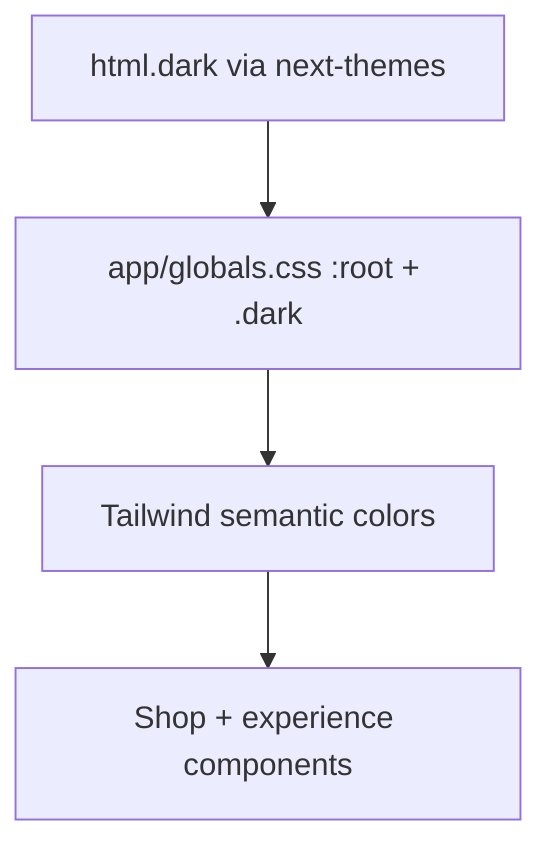

# Site-wide Light/Dark Theme Toggle

**Version:** 2.3.0 · **Last updated:** 2026-06-26

## Overview

The storefront uses a **single token-based theme system**: `next-themes` toggles a `dark` class on `<html>`, and all shop/experience surfaces read semantic CSS variables from [`app/globals.css`](../../../app/globals.css). **Dark is the default** for new visitors.

Light mode uses a **Cursor-inspired palette** — white canvas (`#FFFFFF`), neutral gray text (`~#1C1C1E`), subtle borders (`~#E5E7EB`), **maroon titles/CTAs** (`#251212` via `--experience-title` / `--experience-cta`, footer maroon family), and **brand burgundy** highlight accents (`#9E244D` via `--experience-highlight` for badges, links, tab indicators, gallery dots). Dark mode keeps the warm charcoal experience palette (`#171515` family) with peach highlight (`#FFBA94`) for titles, CTAs, and emphasis.

## Architecture

| Layer | File | Role |
|-------|------|------|
| Provider | [`app/layout.tsx`](../../../app/layout.tsx) | `ThemeProvider attribute="class" defaultTheme="dark"` |
| Wrapper | [`components/theme-provider.tsx`](../../../components/theme-provider.tsx) | next-themes re-export |
| Tokens | [`app/globals.css`](../../../app/globals.css) | shadcn HSL + `--experience-*` + Polaris `--p-color-*` |
| Tailwind | [`tailwind.config.js`](../../../tailwind.config.js) | `darkMode: ["class"]`, semantic + experience color map |
| Toggle | [`components/theme/ThemeToggle.tsx`](../../../components/theme/ThemeToggle.tsx) | Footer sun/moon |
| Experience adapter | [`ExperienceThemeContext.tsx`](../../../app/(store)/shop/experience-v2/ExperienceThemeContext.tsx) | Thin `useTheme()` wrapper for in-experience toggles |
| Stripe | [`lib/shop/stripe-appearance.ts`](../../../lib/shop/stripe-appearance.ts) | Payment Element colors from `--experience-*` vars |

### Token layers

1. **Shadcn semantic** — `bg-background`, `text-foreground`, `border-border`, `bg-card`, `text-muted-foreground`
2. **Experience** — `bg-experience-bg`, `text-experience-text`, `border-experience-border`, `text-experience-title` / `text-experience-cta` (titles + primary CTAs), `text-experience-highlight` (badges, links, tab indicators)
3. **Impact brand chrome** — maroon header/footer (`--impact-*`) — **fixed in both modes**
4. **Polaris** — form components via `--p-color-*` (flips under `.dark`)

### Light experience palette (store / experience pages)

| Token | Value | Use |
|-------|-------|-----|
| `--experience-title` | `#251212` | Product titles, section headings |
| `--experience-cta` | `#251212` | Primary buttons, outline nav chips |
| `--experience-cta-hover` | `#390000` | CTA hover (footer maroon family) |
| `--experience-highlight` | `#9E244D` | Badges, links, tab indicators, gallery dots |
| `--experience-highlight-muted` | `#7a1c3c` | Softer link/highlight states |
| `--experience-highlight-soft` | `#b83a62` | Hover / bright highlight states |
| `--experience-text` | `#1c1c1e` | Body copy |

| Anti-pattern | Replacement |
|--------------|-------------|
| `bg-white` | `bg-background` or `bg-card` |
| `text-[#1a1a1a]` | `text-foreground` |
| `text-[#1a1a1a]/60` | `text-muted-foreground` |
| `border-[#1a1a1a]/10` | `border-border` |
| `bg-[#1a1a1a] text-white` (CTA) | `bg-foreground text-background` |
| `dark:bg-[#171515]` | `bg-background` (token handles dark) |
| `bg-neutral-950` loaders | `bg-background` |
| `theme === 'light' ? x : y` | semantic classes only |

## Implementation files

| Concern | File |
|---------|------|
| Store shell backgrounds | [`app/(store)/layout.tsx`](../../../app/(store)/layout.tsx) |
| Navigation (canonical) | [`ShopUnifiedTopBar.tsx`](../../../components/shop/navigation/ShopUnifiedTopBar.tsx) |
| CSS modules (artist, explore, landing) | `artist-profile.module.css`, `explore-artists.module.css`, `landing.module.css` |

## Testing

Manual checklist (toggle footer sun/moon on each, reload to verify persistence):

- [ ] `/` landing
- [ ] `/shop/products` catalog
- [ ] Product PDP `/shop/[handle]`
- [ ] `/shop/account`
- [ ] `/shop/experience` and `/shop/experience-v3`
- [ ] `/shop/explore-artists`
- [ ] `/shop/artists/[slug]`
- [ ] Checkout success page
- [ ] No hydration warnings in console
- [ ] Mobile safe-area headers intact

### CI guardrail

Run `npm run lint:theme-tokens` to flag reintroduced hardcoded theme colors in `app/(store)/` and `components/shop/`.

## Known limitations

- Footer/header maroon brand styling is intentional in both modes.
- Some video/image scrims still use `bg-black/50` (acceptable for overlays).
- Admin/vendor portals use separate slate-based styling (out of storefront scope).

## Changelog

- **2.3.0 (2026-06-26):** Light-mode `--experience-highlight*` set to brand burgundy (`#9E244D`, muted `#7a1c3c`, soft `#b83a62`); storefront accent hardcodes migrated to `text-experience-highlight` / `ring-experience-highlight` where applicable. Dark mode peach highlight unchanged.
- **2.2.0 (2026-06-26):** Light-mode experience titles and primary CTAs use maroon `#251212` (`--experience-title`, `--experience-cta`); `--experience-highlight` was brand blue for badges, links, tabs, and gallery dots. Dark mode titles/CTAs remain peach via the same semantic tokens.
- **2.1.0 (2026-06-25):** Light-mode `--experience-highlight*` tokens switched from coral/peach to brand blue (`#047AFF`); experience v3 bottom gallery/artist sections migrated off hardcoded dark surfaces (`#0a0909`, etc.) to semantic `bg-experience-surface` / `border-border`.
- **2.0.0 (2026-06-25):** Unified token architecture — merged Tailwind configs, Cursor-inspired light palette, light-mode `--experience-*` tokens, migrated shop/navigation/catalog/experience/checkout to semantic classes, deprecated `LandingThemeProvider`, added Stripe appearance helpers and `lint:theme-tokens` script.
- **1.0.0 (2026-06-10):** Initial release — un-forced light theme, dark default, footer toggle, experience theme adapter.

## Verification checklist

- [x] Implementation: [`app/globals.css`](../../../app/globals.css)
- [x] Implementation: [`tailwind.config.js`](../../../tailwind.config.js)
- [x] Tests: manual matrix above (no automated theme tests)
- [x] Performance: CSS variables, no runtime theme JS on surfaces
- [x] Version: 2.3.0
- [x] Change log updated
