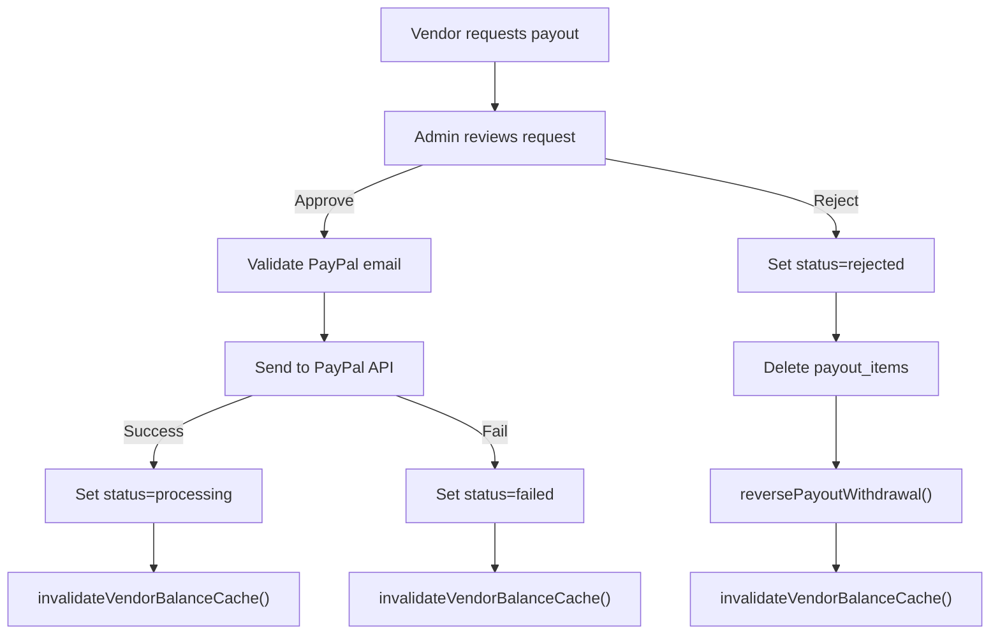
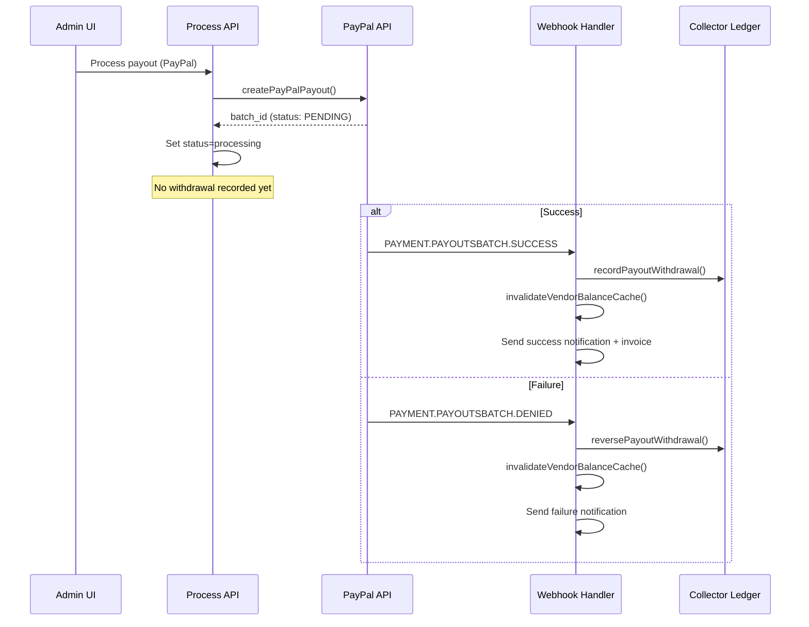

# Payout Architecture — Single Source of Truth

> **Version:** 1.0.0  
> **Last Updated:** 2026-02-14  
> **Status:** Active

## Overview

All vendor payout balances are calculated from the **`collector_ledger_entries`** table. This is the single source of truth for money in the system. No balance is ever re-derived from line item prices or RPC aggregations — the ledger entries are authoritative.

## How Money Enters the Ledger

When a Shopify order line item is **fulfilled**, the fulfillment webhook triggers `depositPayoutEarnings()` in [`lib/banking/payout-deposit.ts`](../../../lib/banking/payout-deposit.ts).

This function:

1. Looks up the vendor's `auth_id` from the `vendors` table (used as `collector_identifier`)
2. Checks for duplicate deposits (one entry per `line_item_id`)
3. Extracts the **original price** from `raw_shopify_order_data` (before discounts)
4. Converts to USD using `exchange_rates` if the order currency is not USD
5. Calculates `payoutAmount = (priceInUSD * DEFAULT_PAYOUT_PERCENTAGE) / 100`
6. Inserts a `collector_ledger_entries` row with:
   - `transaction_type = 'payout_earned'`
   - `currency = 'USD'`
   - `amount = payoutAmount` (positive)
   - `line_item_id` for traceability

## How Money Leaves the Ledger

When a vendor **redeems their balance** (requests a payout), the redeem endpoint calls `recordPayoutWithdrawal()` in [`lib/banking/payout-withdrawal.ts`](../../../lib/banking/payout-withdrawal.ts).

This function:

1. Looks up the vendor's `auth_id`
2. Checks for duplicate withdrawals (one entry per `payout_id`)
3. Inserts a `collector_ledger_entries` row with:
   - `transaction_type = 'payout_withdrawal'`
   - `currency = 'USD'`
   - `amount = -withdrawalAmount` (negative)
   - `payout_id` for traceability

Store purchases using payout balance also create deduction entries with `transaction_type = 'payout_balance_purchase'`.

## Balance Calculation

`calculateVendorBalance()` in [`lib/vendor-balance-calculator.ts`](../../../lib/vendor-balance-calculator.ts) computes the balance by summing all USD ledger entries for a vendor (via `UnifiedBankingService.getBalance()`).

- **Available balance** = sum of all USD entries (earned minus withdrawn minus purchases)
- **Held balance** = sum of `vendor_payouts` records with status `processing`, `pending`, or `requested`
- Results are cached in-memory with a 5-minute TTL

### Cache Invalidation

`invalidateVendorBalanceCache(vendorName)` is called after any operation that changes the balance:

| Operation | File | Trigger |
|-----------|------|---------|
| Vendor redeems payout | [`app/api/vendor/payouts/redeem/route.ts`](../../../app/api/vendor/payouts/redeem/route.ts) | After withdrawal recorded |
| Admin marks items paid | [`app/api/admin/payouts/mark-paid/route.ts`](../../../app/api/admin/payouts/mark-paid/route.ts) | After items marked |
| Admin marks month paid | [`app/api/admin/payouts/mark-month-paid/route.ts`](../../../app/api/admin/payouts/mark-month-paid/route.ts) | After month marked |
| Store purchase with balance | [`app/api/vendor/store/purchase/route.ts`](../../../app/api/vendor/store/purchase/route.ts) | After ledger deduction |

## The DEFAULT_PAYOUT_PERCENTAGE Constant

The payout percentage is defined as a single exported constant:

```typescript
// lib/payout-calculator.ts
export const DEFAULT_PAYOUT_PERCENTAGE = 25
```

All payout calculations import this constant. There are no other hardcoded percentage values in the payout path.

## Race Condition Protection

The redeem endpoint checks for an existing `vendor_payouts` record with `status = 'requested'` before creating a new one. If one exists, the request is rejected with HTTP 409.

## The `product_vendor_payouts` Table

This table exists in the database but is **not used in the money calculation path**. All vendors currently receive `DEFAULT_PAYOUT_PERCENTAGE` (25%).

### Future: Per-Vendor Custom Rates

To enable per-vendor or per-product custom payout rates in the future:

1. Update `depositPayoutEarnings()` in [`lib/banking/payout-deposit.ts`](../../../lib/banking/payout-deposit.ts) to query `product_vendor_payouts` before calculating the payout amount
2. If a row exists for the vendor+product combination, use its `payout_amount` / `is_percentage` fields
3. Otherwise, fall back to `DEFAULT_PAYOUT_PERCENTAGE`
4. The ledger entry will store the actual amount used, so downstream consumers (balance, redeem, display) need no changes

## RPC Functions

### `get_vendor_pending_line_items`

This Supabase RPC function returns line items from `order_line_items_v2` that are eligible for payout. It is now used **only for audit/display purposes** — not for balance calculations. The redeem endpoint calls it to record which line items are associated with a payout for traceability.

### `get_collector_usd_balance`

This Supabase RPC function sums USD ledger entries for a collector. It is called by the banking system internally.

## Key Files Reference

| File | Purpose |
|------|---------|
| [`lib/vendor-balance-calculator.ts`](../../../lib/vendor-balance-calculator.ts) | `calculateVendorBalance()`, cache management |
| [`lib/banking/payout-deposit.ts`](../../../lib/banking/payout-deposit.ts) | `depositPayoutEarnings()` — creates `payout_earned` entries |
| [`lib/banking/payout-withdrawal.ts`](../../../lib/banking/payout-withdrawal.ts) | `recordPayoutWithdrawal()` — creates `payout_withdrawal` entries |
| [`lib/banking/balance-calculator.ts`](../../../lib/banking/balance-calculator.ts) | `calculateUnifiedCollectorBalance()` — low-level ledger sum |
| [`lib/payout-calculator.ts`](../../../lib/payout-calculator.ts) | `DEFAULT_PAYOUT_PERCENTAGE`, `MINIMUM_PAYOUT_AMOUNT`, line item calc |
| [`lib/vendor-payout-readiness.ts`](../../../lib/vendor-payout-readiness.ts) | Pre-requisite checks (profile + ledger balance) |
| [`app/api/vendor/payouts/redeem/route.ts`](../../../app/api/vendor/payouts/redeem/route.ts) | Vendor payout request endpoint |
| [`app/api/vendor/payouts/pending-items/route.ts`](../../../app/api/vendor/payouts/pending-items/route.ts) | Payouts page data (line items + ledger balance) |

## Payout Reversal (`payout_reversal`)

When a payout is **rejected** by an admin or **fails** via PayPal, the system creates a reversal entry to restore the vendor's balance.

The `reversePayoutWithdrawal()` function in [`lib/banking/payout-reversal.ts`](../../../lib/banking/payout-reversal.ts):

1. Looks up the vendor's `auth_id`
2. Checks for an existing reversal for this `payout_id` (idempotent — no duplicate reversals)
3. Creates a `collector_ledger_entries` row with:
   - `transaction_type = 'payout_reversal'`
   - `currency = 'USD'`
   - `amount = +withdrawalAmount` (positive — restores balance)
   - `payout_id` for traceability

### When Reversals Happen

| Scenario | Endpoint | What Happens |
|----------|----------|-------------|
| Admin rejects a request | [`app/api/admin/payouts/approve/route.ts`](../../../app/api/admin/payouts/approve/route.ts) | `reversePayoutWithdrawal()` + cache invalidation |
| PayPal webhook reports failure | [`app/api/webhooks/paypal/route.ts`](../../../app/api/webhooks/paypal/route.ts) | `reversePayoutWithdrawal()` + cache invalidation |
| check-status detects failure | [`app/api/vendors/payouts/check-status/route.ts`](../../../app/api/vendors/payouts/check-status/route.ts) | `reversePayoutWithdrawal()` + cache invalidation |

## Admin Approval/Rejection Flow



## Double Withdrawal Protection

The system ensures each payout results in exactly **one** withdrawal entry in the ledger:

| Payment Method | When Withdrawal is Recorded | File |
|---------------|---------------------------|------|
| PayPal | When PayPal webhook confirms `SUCCESS` | [`app/api/webhooks/paypal/route.ts`](../../../app/api/webhooks/paypal/route.ts) |
| Non-PayPal (manual, bank, stripe) | Immediately at process time (completes synchronously) | [`lib/payout-processor.ts`](../../../lib/payout-processor.ts) |
| check-status transition to completed | On status check (with duplicate protection) | [`app/api/vendors/payouts/check-status/route.ts`](../../../app/api/vendors/payouts/check-status/route.ts) |

The `recordPayoutWithdrawal()` function has built-in duplicate detection: it checks for an existing `payout_withdrawal` entry with the same `payout_id` before creating a new one. This makes all withdrawal calls idempotent.

## PayPal Webhook Lifecycle



## Admin Pending Payouts — Ledger-Based

The admin pending payouts tab now uses ledger-based balances instead of the `get_pending_vendor_payouts` RPC function.

**Old approach:** RPC function queried `order_line_items_v2` + `product_vendor_payouts` with a 10% default (incorrect).

**New approach:** [`app/api/vendors/payouts/pending/route.ts`](../../../app/api/vendors/payouts/pending/route.ts) calls `calculateMultipleVendorBalances()` from [`lib/vendor-balance-calculator.ts`](../../../lib/vendor-balance-calculator.ts) which derives balances directly from the ledger.

### Cache Invalidation (Updated)

| Operation | File | Trigger |
|-----------|------|---------|
| Vendor redeems payout | [`app/api/vendor/payouts/redeem/route.ts`](../../../app/api/vendor/payouts/redeem/route.ts) | After withdrawal recorded |
| Admin marks items paid | [`app/api/admin/payouts/mark-paid/route.ts`](../../../app/api/admin/payouts/mark-paid/route.ts) | After items marked |
| Admin marks month paid | [`app/api/admin/payouts/mark-month-paid/route.ts`](../../../app/api/admin/payouts/mark-month-paid/route.ts) | After month marked |
| Store purchase with balance | [`app/api/vendor/store/purchase/route.ts`](../../../app/api/vendor/store/purchase/route.ts) | After ledger deduction |
| Admin approves/rejects request | [`app/api/admin/payouts/approve/route.ts`](../../../app/api/admin/payouts/approve/route.ts) | After approval or rejection |
| PayPal webhook (success/fail) | [`app/api/webhooks/paypal/route.ts`](../../../app/api/webhooks/paypal/route.ts) | After status change |
| check-status transition | [`app/api/vendors/payouts/check-status/route.ts`](../../../app/api/vendors/payouts/check-status/route.ts) | After status change |
| Instant payout (admin auto-approve) | [`app/api/vendors/payouts/request-instant/route.ts`](../../../app/api/vendors/payouts/request-instant/route.ts) | After withdrawal |

## Change Log

| Date | Change | Author |
|------|--------|--------|
| 2026-02-14 | Initial architecture doc — unified payout system on ledger | System |
| 2026-02-14 | Added payout_reversal type, admin flow docs, double withdrawal protection, PayPal lifecycle, ledger-based pending payouts | System |
