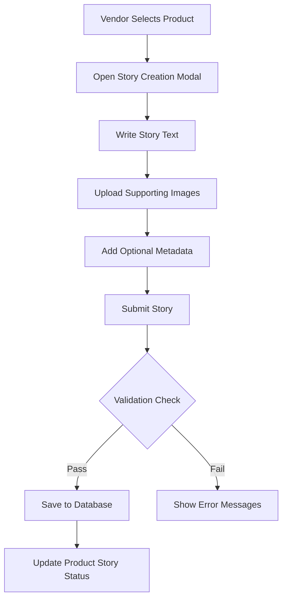

# Vendor Portal: Product Management Guide

## Product Bio and Story Management

### Overview
Vendors can add detailed information about their artwork, including a personal bio and artwork story, to enhance the customer experience.

### Status Tracking
- Bio and artwork story have status tracking
- Statuses: 
  - `incomplete`: No content added
  - `completed`: Content added successfully

### Artist Bio
#### Purpose
- Provide context about the artist's background
- Create a personal connection with collectors
- Showcase the artist's journey and inspiration

#### Adding an Artist Bio
1. Navigate to Vendor Dashboard
2. Go to Product Edit Page
3. Locate "Artist Bio" section
4. Write a compelling narrative (500 characters max)
5. Click "Save Changes"

#### Bio Guidelines
- Be authentic and personal
- Highlight artistic journey
- Mention key influences
- Keep it concise and engaging

### Artwork Story
#### Purpose
- Provide context for the specific artwork
- Share the inspiration behind the piece
- Create emotional connection with collectors

#### Adding an Artwork Story
1. Navigate to Product Edit Page
2. Find "Artwork Story" text area
3. Write detailed narrative (1000 characters max)
4. Click "Save Changes"

#### Story Guidelines
- Describe creative process
- Share inspiration
- Explain artistic techniques
- Include personal meaning
- Be descriptive but concise

### Media Management
- Upload up to 3 supporting images
- Recommended image sizes: 
  - Thumbnail: 300x300 px
  - Detail: 1200x1200 px
- Supported formats: JPEG, PNG, WebP

### Technical Implementation
- Stored in `vendors` and `order_line_items_v2` tables
- Columns: 
  - `bio`: TEXT
  - `bio_status`: TEXT (incomplete/completed)
  - `artwork_story`: TEXT
  - `artwork_story_status`: TEXT (incomplete/completed)

### Best Practices
- Use clear, engaging language
- Be authentic
- Proofread before publishing
- Update stories periodically

### Troubleshooting
- Story not displaying? Check:
  1. Character limit
  2. Save button clicked
  3. Status updated correctly

### Wizard-Based Onboarding

#### Purpose of the Wizard
- Guided experience for vendors
- Step-by-step profile and product story completion
- Improve data quality and user engagement

#### Wizard Stages
1. **Bio Wizard**
   - Collect artist background information
   - 500-character narrative
   - Optional profile image upload

2. **Artwork Story Wizard**
   - Per-product storytelling
   - 1000-character detailed narrative
   - Multiple image support
   - Context and inspiration sharing

### Wizard Features

#### Progress Tracking
- Completion percentage indicator
- Visual progress bars
- Gamification elements

#### Validation
- Real-time character count
- Input validation
- Error guidance

#### Motivation
- Profile strength meter
- Completion rewards
- Enhanced visibility for complete profiles

### Technical Implementation
- Stored in `vendors` and `order_line_items_v2` tables
- Columns: 
  - `bio`: TEXT
  - `bio_status`: TEXT (incomplete/completed)
  - `artwork_story`: TEXT
  - `artwork_story_status`: TEXT (incomplete/completed)
  - `wizard_completion_percentage`: NUMERIC

### Best Practices
- Use clear, engaging language
- Be authentic
- Provide context
- Share personal insights
- Update stories periodically

### Troubleshooting
- Wizard not progressing? Check:
  1. Character limits
  2. Image upload requirements
  3. Validation errors

## Onboarding and Guidance

### Onboarding Tooltips

#### Purpose
Onboarding tooltips provide contextual guidance to help vendors understand how to effectively complete their profiles and share their stories.

#### Tooltip Features
- Contextual help for each wizard step
- One-time display to prevent overwhelming users
- Stored in browser's local storage
- Easily dismissible

#### Tooltip Types
1. **Bio Writing Tooltip**
   - Helps vendors craft a compelling artist bio
   - Provides guidance on content and tone
   - Encourages personal storytelling

2. **Artwork Story Tooltip**
   - Guides vendors in creating meaningful artwork narratives
   - Explains the importance of storytelling
   - Provides tips for engaging descriptions

### Tooltip Interaction
- Tooltips appear with a help icon (?) next to the section
- First-time users see the tooltip automatically
- Can be manually triggered
- Dismissed after first view
- Stored in browser's local storage to prevent repeated displays

### Best Practices for Tooltip Content
- Be concise and actionable
- Use encouraging language
- Provide clear, specific guidance
- Focus on helping vendors tell their unique stories

## Product Story Submission

### Feature Overview
The new product story submission feature allows vendors to create rich, multimedia stories for their products.

### Submission Process
- Navigate to product edit page
- Click "Add Story" button
- Fill out story details:
  - Descriptive text (10-1000 characters)
  - Optional tags
  - Optional location
  - Optional collaborators
  - Multiple image uploads

### Technical Implementation
- API Endpoint: `/api/vendor/submit-story`
- Validation:
  - Zod schema validation
  - Image upload to Supabase storage
  - Row-level security enforcement

### Submission Workflow

### Best Practices
- Use clear, engaging language
- Share the inspiration behind the artwork
- Highlight unique creative processes
- Be authentic and personal

### Performance Considerations
- Image uploads optimized for web
- Lazy loading of story content
- Efficient database queries

## Version
- Implemented in: v1.4.0
- Last Updated: $(date +"%Y-%m-%d") 